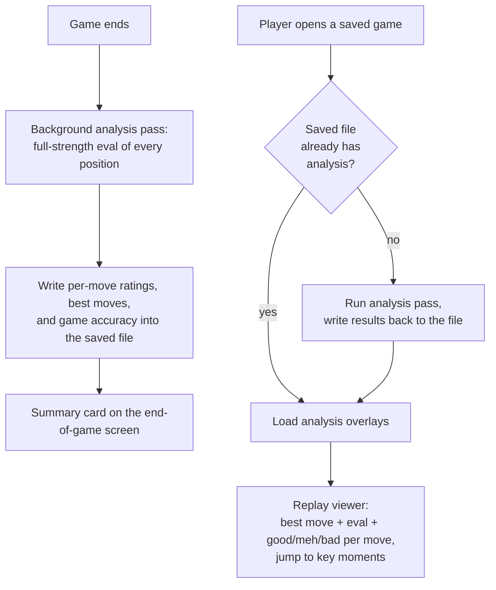

# Post-Game Analysis & Review

## Summary

Post-game analysis layered onto Rozinante's existing replay viewer: stepping through any saved game shows the engine's best move and evaluation at each position and rates the move the player actually made as good / meh / bad, backed by a game-end summary card (blunder/mistake counts + worst moves, accuracy secondary), jump-to-key-moments navigation, and a recent blunder/mistake-count trend across games. Analysis is computed once when a game ends and cached in that game's saved file; opening a game whose file has no analysis recomputes it and writes it back, so games played before this feature are reviewed on first open.

---

## Problem Frame

Rozinante is a chess *learning* game, but its feedback loop ends the moment a game does. A learner can replay a finished game move by move, but the viewer is silent: no evaluation, no indication of which of their moves were sound and which threw the game away, and no "you should have played this instead." The player who just lost has no way to learn *why* — the single most valuable lesson, the one available the instant the position is still fresh, is the one the product withholds.

The endangered-piece highlight only ever showed *opponent* threats during play; nothing has ever told the player that *their own* move was the mistake. And because every replayed game is read back from its saved file with no analysis attached, even revisiting an old game offers nothing beyond the bare moves.

The cost compounds: without per-move feedback the learner repeats the same category of blunder game after game, and without any cross-game signal they can't even tell whether they're improving.

---

## Key Flows

- F1. Review the game you just finished
  - **Trigger:** A game reaches checkmate, stalemate, resignation, or another terminal result.
  - **Actors:** Player; Stockfish (as background analyzer).
  - **Steps:** The result screen appears immediately. A full-strength analysis pass runs in the background over every position. When it completes, the summary card populates (blunder/mistake counts + worst moves, accuracy secondary) and the player can jump straight into the annotated replay.
  - **Outcome:** The player sees how each of their moves rated and what they should have played; the analysis is saved into the game's file.
  - **Escape / failure path:** If analysis is still running or failed, the result screen and plain replay remain fully usable; overlays appear if/when analysis succeeds.

- F2. Review a previously saved game
  - **Trigger:** Player opens a game from the saved-games list.
  - **Actors:** Player; Stockfish (as background analyzer).
  - **Steps:** If the file already carries analysis, overlays load immediately. If not (older game, or an interrupted pass), an analysis pass runs and writes its results back to the file before/while the viewer displays them.
  - **Outcome:** Every reviewed game ends up analyzed and cached; later opens need no recomputation.
  - **Escape / failure path:** Plain step-through works regardless; a game that cannot be analyzed (e.g., engine unavailable) reviews without overlays.

---

## Requirements

**Move analysis & rating**
- R1. When a game ends, the engine evaluates every position the game reached, at full strength (Skill Level momentarily raised to 20 and restored afterward — the existing best-move-hint pattern), producing for each position an evaluation and the engine's best move there. Terminal positions are not sent to the engine — they have no legal reply to evaluate — and an engine reply of `bestmove (none)` is treated as a no-move result, never awaited in a loop. A player move that delivers checkmate is rated good; a player move that ends the game in a draw (stalemate or another drawn terminal) is still rated by centipawn loss against the engine's best move at the prior position (a draw is 0.00, known without the engine), so throwing away a win by stalemate rates bad.
- R2. Each move the *player* made is rated into one of three tiers — good / meh / bad — based on how much the evaluation worsened versus the engine's best move at that position (centipawn loss). Centipawn loss is measured from the moving player's perspective: because the engine reports `cp` relative to the side to move, the evaluation of the position *after* the player's move (when it is the opponent's turn) is negated before comparison, and this player-relative convention holds whether the player is White or Black. In these terms **meh** is a minor inaccuracy and **bad** is a mistake or blunder; the "blunder/mistake count" surfaced on the summary card and across games is the number of **bad** moves (meh inaccuracies are shown per move but not folded into that headline count). Stockfish's own moves are evaluated (needed for the eval swings and key moments) but are not tier-rated.
- R3. Forced-mate evaluations are represented distinctly from ordinary centipawn scores, so a position with a forced mate is never treated as roughly even; a move that misses a forced mate for the player, or walks into one, rates as bad. A mate score maps to a saturating magnitude that dominates any centipawn value, so a missed or allowed mate both rates bad and dominates the key-moment ranking (R6).

**Replay viewer integration**
- R4. In the replay viewer, each position shows the engine's best move there (in the same notation the move list already uses) and its evaluation, shown from the player's perspective (positive = the player is better) and kept consistent with the board orientation.
- R5. As the player steps through, the move that led to the current position carries its quality tier (good / meh / bad), shown alongside that move, so the player sees move by move how each of their moves rated.
- R6. The viewer provides a key to jump to the next/previous "key moment" — the positions where the evaluation swung the most. The player's worst moves surface through this navigation.
- R7. When a game has no analysis available (still computing, never analyzed, or analysis failed), the viewer stays fully usable for plain step-through; the analysis overlays appear only once analysis is available.

**Game-end summary**
- R8. When a game ends, the player is shown a summary card led by the counts of their blunders and mistakes plus their worst few moves — with a way to jump straight into reviewing those moments in the viewer. An overall accuracy figure appears as a secondary number, comparable only within a fixed difficulty (the opponent is deliberately weakened, so lopsided wins inflate it).
- R9. The game-end analysis pass runs in the background — the end-of-game result screen appears immediately and the summary card/marks fill in when the pass completes. The player is never blocked waiting on analysis.

**Persistence & backfill**
- R10. Completed analysis is saved into that game's saved file, survives app restarts, and is reused on later replay with no recomputation. Write-back is atomic — a new file written and swapped into place, matching Rozinante's existing crash-safe save path, and sized for a fully-annotated maximum-length game — so an interrupted or failed write leaves the original saved game intact and merely un-annotated, never truncated.
- R11. Opening a saved game whose file contains no analysis triggers a fresh analysis pass, and the result is written back to that file — so games played before this feature, or games whose analysis was interrupted, get analyzed on first review and cached thereafter. Detection uses a positive "analyzed" completeness marker recorded in the file (carrying a format version and the ply-count covered), written only after the full pass completes — so a cleanly-played game is not mistaken for an unanalyzed one, a crash-interrupted partial pass is detected as incomplete and re-run, and a foreign or hand-annotated game is never misread as Rozinante's analysis.
- R12. Stored analysis keeps the game file valid for standard chess tools: a Rozinante-annotated game remains openable by other chess software (annotations use the saved format's standard annotation mechanism, not a private sidecar).

**Cross-game progress**
- R13. Each analyzed game's blunder/mistake count and overall accuracy are surfaced in the saved-games list, and the list shows a simple recent trend across the player's games — counts as the primary signal, accuracy secondary and comparable only within a fixed difficulty. This is a lightweight signal, not a full statistics dashboard.

---

## Acceptance Examples

- AE1. **Covers R2, R4, R5.** Given a finished game in which the player hung their queen on move 18, when the player steps to move 18 in the viewer, that move is tagged "bad" and the engine's best move and evaluation for the position before it are shown.
- AE2. **Covers R11.** Given a game saved before this feature existed (its file has no analysis), when the player opens it in the viewer, an analysis pass runs and its results are written back to the file; reopening the same game later shows the analysis without recomputing.
- AE3. **Covers R9.** Given a game that just ended, when the result screen appears, the player can leave it immediately; the summary card populates once the background pass finishes rather than blocking the screen.
- AE4. **Covers R3.** Given a position with a forced mate available to the player that they miss by playing a quiet move, when that move is rated, it rates "bad" rather than being treated as a roughly even position.
- AE5. **Covers R6.** Given an analyzed game, when the player presses the key-moment key, the viewer jumps to the position of their single largest evaluation swing.
- AE6. **Covers R2.** Given the player is Black and plays a sound developing move, when it is rated, it rates "good" (not "bad") — ratings are computed from the player's perspective regardless of color.

---

## Success Criteria

- After any game, the player can see, move by move, which of their moves were good/meh/bad and what the engine would have played instead — and over several games can tell whether their blunder/mistake counts are trending down (accuracy a secondary signal).
- Reviewing an old game is no different from reviewing a fresh one: it analyzes on first open and is instant thereafter.
- `ce-plan` has the product behavior it needs — the rating tiers, what gets persisted, and the backfill rule are specified here. Open items are deferred below: the centipawn thresholds / accuracy formula, the on-file encoding + completeness marker, the background-pass lifecycle, the per-position think-time budget, and the viewer/card interaction design (where the tier, best move, and eval sit in the panel; pending-vs-failed visual states; key-moment key bindings; and the summary-card surface plus the jump-into-review interaction).

---

## Scope Boundaries

- Personal blunder-drill / spaced-repetition practice mode (ideation idea #4) — it consumes this analysis pipeline but is a separate build.
- Live in-game move-quality feedback (idea #2) and graduated hints (idea #3) — different surfaces, separate ideas.
- Threefold-repetition detection and redo-after-undo (idea #5).
- MultiPV / multiple candidate lines and full variation trees — a single best move per position is enough.
- Tier-rating Stockfish's own moves — its moves are evaluated for the eval graph and key moments, but not labeled good/meh/bad.
- A full statistics dashboard — cross-game progress is limited to per-game blunder/mistake counts and accuracy plus a simple recent trend in the games list.
- A user-facing setting for analysis depth/think-time — an internal default is used.

---

## Key Decisions

- **Analysis is cached in the saved game file with on-demand backfill** (the player's explicit choice over lighter session-only recompute): every game becomes reviewable, including ones played before the feature, and the files stay portable to standard chess tools. Accepted cost is round-tripping annotations through the saved file format.
- **The game-end pass runs in the background**, reusing the existing concurrent-engine + event-post pattern, so the result screen never blocks on analysis.
- **Three rating tiers (good / meh / bad) on the player's moves**, with a continuous accuracy figure derived separately. Keeps the signal legible for the beginner core audience rather than a finer 5–6 tier scheme.
- **Evaluation is always full strength**, regardless of the game's chosen difficulty — a learner needs a trustworthy "best move," matching the existing decision behind best-move hints.
- **Post-game (passive) review first, in-game (active) feedback next.** Post-game analysis is the chosen build, but in-game move-quality feedback (idea #2) is the fresher learning signal — it fires while the position is still in working memory, is cheap (reuses the momentary-full-strength-hint pattern), and barely depends on this pipeline. This build deliberately ships the passive surface first; #2 is the most likely next feature.
- **Progress is led by blunder/mistake counts, not an accuracy percentage.** A percentage isn't beginner-actionable and is confounded by the deliberately-weakened opponent; counts map directly to behavior (play fewer blunders). Accuracy is retained as a secondary figure, comparable only within a fixed difficulty.

---

## Dependencies / Assumptions

- Requires Stockfish at runtime (already a runtime dependency). Total analysis cost scales with game length × per-position think-time.
- The live `Game` already retains per-ply board/move history, so a game-end pass over the positions is cheap to drive; once a game is reloaded from its saved file that in-memory history is gone, which is why backfill re-derives analysis from the reconstructed positions.
- The saved file format can carry per-move annotations and a per-game accuracy value while staying valid for other tools. **Verified:** the format (PGN) supports move annotations (NAGs), comments, and custom header tags; **the current writer and parser do not yet round-trip them** — that is implementation work, not a format limitation.
- Pass duration is per-position think-time × ply count. At the existing full-strength budget (500 ms/position) a 40-move game already runs ~40 s and long games run to minutes; the background, non-blocking design tolerates this, though a reduced-depth tier for backfill may be warranted. The think-time-vs-trustworthiness tradeoff is a planning decision. [Needs validation during planning.]

---

## Outstanding Questions

### Deferred to Planning

- [Affects R2, R8][Needs research] Exact centipawn-loss thresholds for good / meh / bad (equivalently: sound / inaccuracy / mistake-or-blunder) and the accuracy-% formula — verify against established references (e.g. lichess / chess.com) rather than inventing numbers.
- [Affects R1, R3, R6, AE4][Blocking] The engine's info-line parser currently reads `cp` only and ignores `mate`, so a mate position parses as 0.00 today — which makes R3/AE4 fail and corrupts R6 key-moment ranking. Mate-score capture (mapping mate-in-N to a saturating magnitude) is a blocking dependency for R3, AE4, R6, and the accuracy figure, not an optional nicety.
- [Affects R10, R11, R12][Technical] The on-file encoding of per-move ratings, best moves, the per-game accuracy, and the positive completeness marker. `{comment}` blocks are currently skipped on read (their content is discarded in `parseMovetext`) and inline `$N` NAG tokens make `sanToMove`/`parsePgn` error out outright — so any *inline* encoding (comment or NAG) needs a parser read-path change to capture analysis, and a NAG-annotated file is currently unopenable by Rozinante itself; only per-game values placed in custom header tags reuse the existing tag parser. Prefer comment/custom-tag encoding and treat reading any inline annotation back as a parser change, not just a writer addition.
- [Affects R9, R11][Technical] The background pass needs a screen-bounded lifecycle, not just scheduling: leaving the screen (New Game, Quit, Esc from the viewer) must cancel-and-await the pass (stop, await the thread, confirm Skill Level restored) before any other engine command runs, and no opponent move or hint may dispatch while a pass is in flight — the existing human-turn / cancel-before-getMove guards do not cover a pass that spans screen transitions. Separately, the review/backfill path (`runGameViewer`/`runGameHistory`) currently holds no engine, so it must provision one.
- [Affects R1][Technical] Per-position think-time / depth budget, trading analysis quality against pass duration.
- [Affects R4, R5, R6, R7, R8][Design] Viewer/card interaction design in the cramped (~21-column) side panel: where the tier, best move, and eval sit and what they displace; distinct visual treatments for pending vs clean vs failed analysis; the next/previous key-moment key bindings plus a count/index indicator; and whether the summary card is a separate screen, an overlay, or panel content, including the concrete "jump into review" interaction (worst-move selection → open viewer at that ply).
