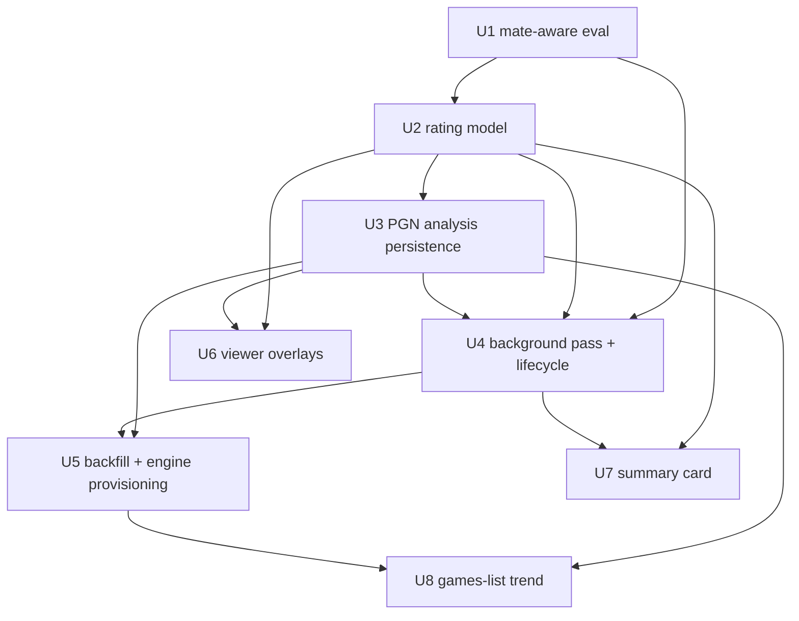
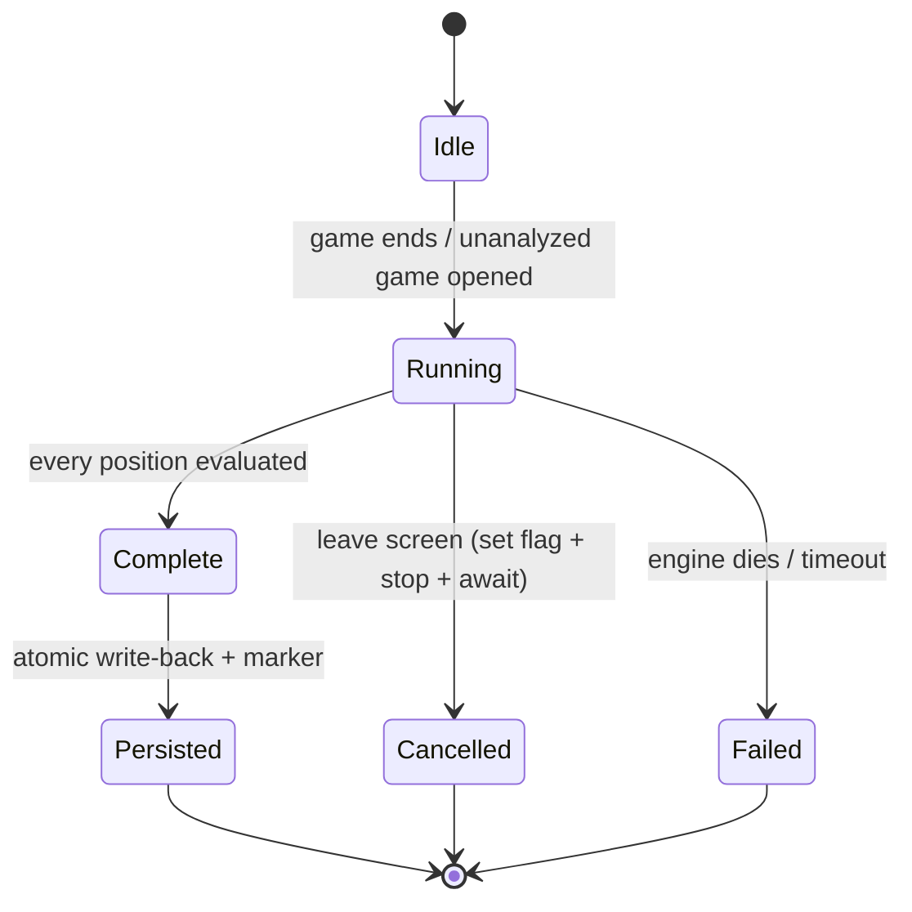

# feat: Post-game analysis & review

## Summary

Layer post-game analysis onto Rozinante's existing replay viewer. When a game ends, a background full-strength Stockfish pass evaluates every position the game reached, rates each of the *player's* moves good / meh / bad by player-perspective centipawn loss, and records the engine's best move + evaluation at each position. The replay viewer then shows the best move, the evaluation, and the per-move tier as the player steps through, plus a key to jump to the biggest evaluation swings; a game-end summary card leads with the player's blunder/mistake counts and worst moves. The analysis is cached **in the saved game file** using PGN's own annotation mechanisms (per-move comments + custom header tags), written atomically; opening a game whose file has no analysis recomputes it and writes it back, so games played before this feature are analyzed on first open. The saved-games list surfaces each game's blunder/mistake count (accuracy secondary) and a simple recent trend.

The work spans `src/engine.zig` (mate-aware eval), a new pure `src/analysis.zig` (rating model + data types), `src/persistence/pgn.zig` + `src/persistence/storage.zig` (annotation round-trip + atomic write-back + cheap header read), `src/main.zig` (background pass, screen-bounded lifecycle, backfill, engine provisioning), and `src/tui/viewer.zig` + `src/tui/renderer.zig` + `src/tui/history.zig` + `src/tui/game.zig` (overlays, summary card, games-list trend). It builds directly on the already-landed `analyzeFullStrength` Skill-Level-raise pattern, the `io.concurrent` + vaxis-event analysis dispatch, the `Marks`/`drawMarks`/`Palette` rendering vocabulary, and the atomic `storage.saveGame` save path.

---

## Problem Frame

Rozinante is a chess *learning* game whose feedback loop ends the moment a game does: the replay viewer is silent — no evaluation, no indication of which moves were sound, no "you should have played this." Full pain narrative and rationale live in the origin doc (see Sources & References). This plan makes the finished game the primary teaching surface, both for fresh games and for games already on disk.

---

## Requirements Traceability

| Origin item | Where addressed |
|---|---|
| R1 (full-strength eval of every position; terminal positions not sent to the engine, but the *reaching* move still rated — checkmate→good, stalemate/draw-throw→bad via a synthesized terminal eval; `bestmove (none)` = no-move) | U4 (pass), U2 (terminal rating), U1 (mate-aware eval) |
| R2 (3 tiers from player-perspective centipawn loss; meh = inaccuracy, bad = mistake/blunder; headline = bad count) | U2 |
| R3 (mate distinct from cp; missed/allowed mate rates bad; dominates key-moment ranking) | U1, U2 |
| R4 (viewer shows best move + eval, player perspective) | U6 |
| R5 (per-move tier shown as player steps through) | U6 |
| R6 (jump to next/previous key moment) | U2 (ranking), U6 (navigation) |
| R7 (no analysis → plain step-through stays usable; overlays only when present) | U5 (degrade), U6 (conditional overlay) |
| R8 (summary card led by blunder/mistake counts + worst moves + jump-into-review; accuracy secondary) | U7 |
| R9 (background pass; result screen never blocks) | U4 |
| R10 (atomic write-back, sized for a fully-annotated max-length game) | U3 |
| R11 (backfill on open; positive "analyzed" completeness marker = version + ply-count) | U3 (marker + read), U5 (backfill) |
| R12 (file stays valid for standard chess tools; standard annotation mechanism, no private sidecar) | U3 |
| R13 (games-list per-game counts + accuracy + recent trend) | U8 |
| F1 (review the game you just finished) | U4, U7 |
| F2 (review a previously saved game) | U5, U6 |
| AE1 (R2/R4/R5: hung queen → "bad" + best move/eval shown) | U2, U6 |
| AE2 (R11: pre-feature game backfills and caches) | U5 |
| AE3 (R9: result screen leaveable; card fills when pass completes) | U4, U7 |
| AE4 (R3: missed forced mate → "bad", not roughly even) | U1, U2 |
| AE5 (R6: key-moment key jumps to largest swing) | U6 |
| AE6 (R2: Black's sound move → "good", perspective-correct) | U2 |

**Origin IDs:** Flows F1–F2 and Acceptance Examples AE1–AE6 (origin doc). Actors are Player + Stockfish-as-analyzer, carried in the flows; no A-IDs defined in origin.

---

## Scope Boundaries

Carried from the origin doc (non-goals this plan does not build):

- Personal blunder-drill / spaced-repetition practice mode (ideation idea #4) — consumes this pipeline but is a separate build.
- Live in-game move-quality feedback (idea #2) and graduated hints (idea #3) — different surfaces, separate ideas.
- Threefold-repetition detection and redo-after-undo (idea #5).
- MultiPV / multiple candidate lines and full variation trees — a single best move per position is enough.
- Tier-rating Stockfish's own moves — its moves are evaluated for the eval graph and key moments, but not labeled good/meh/bad.
- A full statistics dashboard — cross-game progress is limited to per-game blunder/mistake counts and accuracy plus a simple recent trend in the games list.
- A user-facing setting for analysis depth/think-time — an internal default is used.

### Deferred to Follow-Up Work

- A reduced-depth backfill tier (faster, less trustworthy analysis on long games) — the mechanism uses one full-strength budget; a reduced budget is a tunable knob, not built in this plan.

---

## Context & Research

### Relevant Code and Patterns

- **Engine & analysis (`src/engine.zig`):** `analyzeFullStrength(board, ms)` (engine.zig:216-222) raises Skill Level to 20 and restores it via `defer` on all exit paths; the analysis result carries the evaluation. `parseInfoLine` (engine.zig:278-296) tokenizes `depth` and `cp` **only** — it does not parse `score mate N` (the [Blocking] gap). `parseBestMove` (engine.zig:265-277) returns `null` when the move string is not 4–5 chars, so `bestmove (none)` already arrives as a no-move (no crash). `stop()` (engine.zig:224-228) sends UCI `stop`. `Engine` carries `skill: u8` (engine.zig:18-33).
- **Concurrent analysis dispatch (`src/main.zig`):** `analysisWork` (main.zig:109-126) is the `io.concurrent` task → calls `analyzeFullStrength(board, 500)` → posts `.engine_analysis_ready`. `dispatchAnalysis` (main.zig:157-180) gates on `isHumanTurn` + `hints_enabled` + an `analysis_pending` flag; `cancelAnalysis` (main.zig:192-209) sends `eng.stop()` and awaits the `analysis_future: ?Io.Future(void)`. The cancel-before-dispatch pattern is at main.zig:846; the `.engine_analysis_ready` handler at main.zig:876-896. The 500 ms hint budget is at main.zig:109.
- **Game-end seams:** `Game.executeMove` (game.zig:393-408) auto-detects checkmate/draw → sets `game_phase = .ended` (`GamePhase` enum, game.zig:27-30) + `result: ?[]const u8`. Resign (main.zig:770-785) does `cancelAnalysis` + `.ended` + result + `autoSave`. `isHumanTurn` (game.zig:580-586) returns `false` when `game_phase != .playing`, so a post-game pass **cannot** reuse that guard.
- **Replay viewer (`src/tui/viewer.zig`):** `ViewerState` (viewer.zig:14-21) = `{boards ptr, san_list ptr, position index, total}`; `currentBoard()` = `&boards[position]`; `handleInput` (viewer.zig:22-53) steps/jumps and returns `ViewerAction{none, back}`. The viewer has its **own** `renderInfoPanel` (viewer.zig:90-137), separate from renderer.zig's. `runGameViewer(io, alloc, loop_ptr, vx, tty, filepath: ?[]const u8)` (main.zig:412-447) loads the PGN, reconstructs `boards[0..move_count]` via `chess.makeMove`, and computes SAN via `pgn.computeSan(record, before, after)`. **`runGameViewer`/`runGameHistory` (main.zig:352-447) hold no `Engine`** — the per-game `current_engine: ?Engine` (main.zig:699-714) lives only in the game loop.
- **Rendering (`src/tui/renderer.zig`):** `renderBoardCore(win, board: *const chess.Board, opts, flipped, highlight: ?*Game)` (renderer.zig:355-430) draws marks only when `highlight != null`. `renderInfoPanel(win, game: *const Game)` (renderer.zig:469-656) is the live-game side panel (~21 cols: `info_w = win.width - boardWidth(opts) - 1`; board = 98 cols at default 12×6 cells); end-of-game shows `game.result` in `highlight_check` color (renderer.zig:489-493); the move list (renderer.zig:633-648) renders pairs with the current move highlighted. `Marks{border: ?BorderStyle, cursor, endangered, best_move, center}` (renderer.zig:187-195) + `drawMarks` (renderer.zig:244-330, no-op if `cell_w<12` or `cell_h<6`). `Palette` (renderer.zig:6-18) has 17 color fields; mark colors are theme-invariant across the 4 themes.
- **Saved-games list (`src/tui/history.zig`):** `HistoryScreen` list (history.zig:14-39); render (history.zig:73-140) is 60 cols wide, columns Date @1 / Elo @13 / Color @19 / Result @27; `displayResult` (history.zig:129-132). `GameInfo` (storage.zig:10) = `{filename, date, elo, player_color, result, is_finished}` — no analysis metadata today.
- **Persistence (`src/persistence/`):** `writePgn(buf, header, move_records, board_history) PgnError![]const u8` (pgn.zig:481) emits the 7 standard tags + movetext SAN only — **no comments/NAGs/custom tags**. `parseMovetext` (pgn.zig:380) **skips and discards** `{comment}` content (pgn.zig:659-661). `parseTags` (pgn.zig:418) keeps only the 7 standard tags and **drops** custom ones. `sanToMove` (pgn.zig:302) strips trailing `+#!?` (pgn.zig:313-318) but errors on inline `$N` NAGs. `computeSan(record, before, after)` (pgn.zig:27-45). `MAX_GAME_MOVES = 512`. `storage.saveGame` (storage.zig:73-91) is **atomic** (`createFileAtomic` → `writeStreamingAll` → `atomic.replace`, with `errdefer`); `loadGame` (storage.zig:93) reads up to 1 MB; `listGames` (storage.zig:99-158) reads the Result tag cheaply via `readResultTag`. **`autoSave` (main.zig:271-340) is the in-play path: a 32 KB stack buffer, non-atomic `dir.writeFile` on an existing path** — it strips annotations and must not be the analysis write-back path.

### Institutional Learnings

- None — `docs/solutions/` does not exist in this repo.

### External References

- **lichess move classification** (researched during planning): centipawn-loss thresholds are inaccuracy ≥ 50 cp, mistake ≥ 100 cp, blunder ≥ 300 cp. **Accuracy %** is win-probability-based (engine cp → logistic win%; per-move win% lost, aggregated by harmonic mean), not raw average centipawn loss. These ground U2's tiers and accuracy figure; exact cutoffs/constants are tunable, not invented.

---

## Key Technical Decisions

- **Mate-aware evaluation as a tagged union (U1).** `parseInfoLine` gains `score mate N`. Represent an evaluation as `Eval = union(enum) { cp: i32, mate: i32 }` (signed mate-in-N: positive = side-to-move mates, negative = gets mated). A saturating `toCp(Eval)` maps a mate to ±(`MATE_BASE` − |N|) where `MATE_BASE` dominates any realistic centipawn value, so a missed or allowed mate both rates bad and tops the key-moment ranking. This resolves the origin's [Blocking] item; without it, mate positions parse as 0.00 and break R3/AE4/R6.
- **Rating from player-perspective centipawn loss, lichess-grounded tiers (U2).** For player ply *i* (board before = `boards[i]`, after = `boards[i+1]`): `cpl = max(0, toCp(best_eval_at_i) − (−toCp(eval_at_i+1)))`. The negation converts `boards[i+1]`'s side-to-move evaluation (opponent's turn) back to the player's perspective; the convention holds for both colors. Tiers: **good** < 50 cp, **meh** (inaccuracy) 50–99 cp, **bad** (mistake/blunder) ≥ 100 cp — derived from the lichess thresholds (mistake ≥ 100 and blunder ≥ 300 collapse into "bad"). The headline "blunder/mistake count" is the number of **bad** moves; meh inaccuracies are shown per-move but excluded from the count. Accuracy is a **secondary** win-probability figure (logistic win% + harmonic mean), comparable only within a fixed difficulty. Only player moves are tier-rated; Stockfish moves get evals (for swings/key moments) but `tier = null`.
- **In-file hybrid encoding via PGN's own annotation mechanisms (U3).** Per-move analysis → inline `{comment}` after each move (e.g. `{roz: bad best=Qh5 eval=+120}`), which standard tools render. Per-game scalars + the completeness marker → a single custom header tag after the 7 standard ones (e.g. `[RozAnalysis "v1 plies=80 bad=3 meh=5 acc=78.4"]` — one cheap-to-scan tag carrying version + ply-count + counts + secondary accuracy). This requires teaching the reader to round-trip what it discards today: `parseMovetext` captures each comment and attaches it to the preceding ply (instead of dropping it), and a header reader captures the `RozAnalysis` tag. Chosen over a private sidecar (R12) and over an all-in-one custom-tag CSV (per-move comments are the standard, tool-visible annotation mechanism). The marker is written **only after the full pass completes**, so a cleanly-played game isn't mistaken for unanalyzed, an interrupted partial (ply-count mismatch) is detected and re-run, and a foreign/hand-annotated game is never misread.
- **Write-back through a path-targeted atomic write, never the in-play `autoSave` (U3/U4).** Analysis is computed only at game-end/backfill (`game_phase == .ended`), after which `autoSave` (which strips annotations and writes non-atomically) no longer fires — it triggers on `move_count` change during play, and there is no analysis to lose while the game is live. Both write-backs serialize through an analysis-aware writer and a **path-targeted** atomic helper (`createFileAtomic(filename, .{ .replace = true })` + `replace` on the opened file's own path — NOT `saveGame`, which regenerates the filename), sized for a fully-annotated max-length (512-ply) game.
- **Background pass with a screen-bounded cooperative-cancel lifecycle (U4).** Reuse the `io.concurrent` + vaxis-event pattern: one task iterates every position, checks an atomic cancel flag between positions, and posts a single `.analysis_pass_ready` event on completion (the result screen shows an "analyzing…" state until then). Leaving the screen (new game / quit / Esc) sets the flag and **awaits** the task before any other engine command runs — cooperative, NOT `eng.stop()` (a `stop()` write would race the worker's per-position `sendCommand` on the shared `stdin_writer`); this extends the existing cancel-before-`getMove` guard, which does not cover a pass spanning screen transitions. The pass dispatches outside `isHumanTurn()` (false once the game has ended).
- **Lazy engine provisioning in the review path (U5).** `runGameViewer`/`runGameHistory` hold no engine. On opening a game whose file lacks a complete marker, provision an engine (the existing `findStockfish` → init → handshake path), run the pass, write back, and deinit on leave. If Stockfish is unavailable, the viewer degrades to plain step-through with no overlays (R7).
- **Single full-strength think-time budget for both passes (U4) — user-confirmed.** 500 ms/position for the game-end pass and backfill alike (≈ 40 s for a 40-move game; minutes for long games — all background, non-blocking). A reduced backfill budget is left as a tunable knob (Deferred to Follow-Up Work), not built now.
- **Tier rendering reuses the marks/palette vocabulary (U6/U7).** Add `eval_good` / `eval_meh` / `eval_bad` to `Palette` (theme-invariant, like the other mark colors). Per-move tier = a glyph in the viewer's move list using **three distinct glyph shapes** (good/meh/bad — not color alone, so the rating survives a colorblind reader and any theme), with the `eval_*` colors as reinforcement; the current position's best move + eval = a panel line; key moments = position jumps via a new key + a k/m index indicator; the summary card = end-of-game panel content with a key to open the viewer at the worst move. Exact glyphs, columns, and RGBs are tuned against the `zig build preview` gallery (the repo's visual-verification vehicle).
- **Cross-game trend is a lightweight derived signal (U8).** Each `GameInfo`'s bad/meh counts + accuracy are read cheaply from the single `RozAnalysis` header tag in `listGames` (no movetext parse); the games-list trend is a direction indicator over the last-N analyzed games' bad counts (down = improving), suppressed with fewer than 2 analyzed games. Counts-led, accuracy secondary — not a statistics dashboard (R13).

---

## High-Level Technical Design

> *This illustrates the intended approach and is directional guidance for review, not implementation specification. The implementing agent should treat it as context, not code to reproduce.*

### Unit dependency graph



### Analysis data types (new `src/analysis.zig`, pure — depends on `chess` only)

```
Eval  = union(enum) { cp: i32, mate: i32 }           // engine output, side-to-move POV
Tier  = enum { good, meh, bad }
MoveAnalysis = {
    eval:      Eval,          // eval of the position AFTER this move
    best:      chess.Move,    // engine's best move at the position BEFORE this move
    best_eval: Eval,          // eval of that best line (player-to-move POV)
    cpl:       i32,           // player-perspective centipawn loss (player moves only)
    tier:      ?Tier,         // player moves only; null for Stockfish moves
}
GameAnalysis = {
    moves: [MAX]MoveAnalysis, count: u16,
    blunders: u16, inaccuracies: u16, accuracy: f32,   // player aggregates
    key_moments: [K]u16,      // plies sorted by |eval swing| descending
    version: u8, plies_covered: u16,                   // completeness marker
}
```

### Rating (directional)

```
toCp(e): switch e { .cp => |c| c, .mate => |n| sign(n) * (MATE_BASE - abs(n)) }

rateMove(best_eval_at_i, eval_at_iplus1):
    after_player = -toCp(eval_at_iplus1)     // flip opponent-POV → player-POV
    cpl = max(0, toCp(best_eval_at_i) - after_player)
    tier = if cpl >= 100 .bad else if cpl >= 50 .meh else .good
```

### Background-pass lifecycle



`Cancelled` and `Failed` write **no** marker, so the game is re-analyzed on next open (R11). Skill Level is restored via `analyzeFullStrength`'s `defer` on every exit.

---

## Implementation Units

### U1. Mate-aware evaluation capture

**Goal:** The engine represents and parses forced-mate scores distinctly from centipawn scores, so a mate position is never read as 0.00.

**Requirements:** R1 (eval shape), R3, AE4 (precondition)

**Dependencies:** None

**Files:**
- Create (seed): `src/analysis.zig` holding `Eval` + `toCp` (U2 extends this same file with the rest of the model). U1 owns `Eval`/`toCp` since it lands first.
- Modify: `src/root.zig` — add `pub const analysis = @import("analysis.zig");`, mirroring the `engine`/`openings` re-exports at root.zig:6-7. **Required, not optional:** `main.zig` is the exe-module root and imports only the `rozinante` lib module, so a relative `@import("analysis.zig")` from `main.zig` would compile a second, distinct copy whose `Eval`/`GameAnalysis` mismatch the lib-module types the engine/viewer produce.
- Modify: `src/engine.zig` (`parseInfoLine` parses `score mate N`; the analysis result carries an `analysis.Eval` instead of a bare centipawn integer).
- Test: `src/engine.zig` (inline) and `src/analysis.zig` (inline, for `toCp`)

**Approach:**
- Extend `parseInfoLine` to recognize `score mate N` (signed) alongside `score cp N`, returning the analysis result's eval as `Eval{ .mate = N }` or `Eval{ .cp = N }`.
- Define `toCp(Eval) i32` with a `MATE_BASE` constant chosen to dominate any realistic centipawn magnitude (sign preserved). This is the single comparison/ranking currency for U2.
- Keep the existing `cp`-only behavior byte-identical when no `mate` token is present.

**Patterns to follow:** the existing `parseInfoLine` tokenizer and its tests; `parseBestMove`'s null-on-unparseable convention.

**Test scenarios:**
- Happy path: `parseInfoLine` on `... score cp 35 ...` → `Eval{cp=35}`; on `... score mate 3 ...` → `Eval{mate=3}`; on `... score mate -2 ...` → `Eval{mate=-2}`.
- `toCp(Eval{cp=35}) == 35`; `toCp(Eval{mate=1})` exceeds any plausible cp and is positive; `toCp(Eval{mate=-1})` is the large negative counterpart; `toCp` of mate-in-1 magnitude > mate-in-5 magnitude (closer mate dominates).
- Covers AE4 (precondition): an info line carrying `mate` no longer yields a 0.00 evaluation.
- Edge: an info line with neither `cp` nor `mate` is handled per the existing convention (no spurious 0.00 written as a real eval).

**Verification:** `zig build test` green; feeding the parser a `mate` info line yields a distinct, dominating evaluation rather than 0.00.

---

### U2. Move-rating model + analysis data types

**Goal:** Pure functions and types that turn per-position evaluations into per-move tiers, player aggregates (blunder/mistake counts, accuracy), and a key-moment ranking — with no engine or I/O dependencies.

**Requirements:** R1 (terminal rating), R2, R3, R6 (ranking), AE1 (rating), AE4 (rating), AE6

**Dependencies:** U1 (`Eval`, `toCp`)

**Files:**
- Extend: `src/analysis.zig` — add `Tier`, `MoveAnalysis`, `GameAnalysis`, `rateMove`, `aggregate`, `computeKeyMoments` (`Eval`/`toCp` were seeded by U1). Depends on `chess` only.
- (No new `src/root.zig` change — U1 already re-exports `analysis` to the exe module.)
- Test: `src/analysis.zig` (inline)

**Approach:**
- `rateMove(best_eval_at_i, eval_at_iplus1) -> { cpl, tier }` per the directional sketch: negate the after-eval to the player's perspective, clamp loss ≥ 0, threshold into good/meh/bad. Color-agnostic by construction.
- **Terminal-reaching move (R1).** The position *after* the game-ending move is terminal and gets no engine eval, so its after-eval is **synthesized** without an engine call from the chess core's checkmate/stalemate detection (the `executeMove` signal at game.zig:393-411): a checkmate-delivering move gets a mate-magnitude after-eval (cpl ≈ 0 → **good**); a drawn terminal (stalemate or other draw) gets `cp = 0`, so it is rated by cpl vs the prior position's best — throwing away a winning position by stalemate rates **bad**. The final ply then flows through `aggregate`/`computeKeyMoments` like any other.
- `aggregate(moves) -> { blunders, inaccuracies, accuracy }`: blunders = count of `tier == .bad` on player plies; inaccuracies = count of `tier == .meh`; accuracy = win-probability-based figure (logistic win% per move, harmonic-mean aggregate). Constants are tunable (lichess-grounded). With **zero rated player moves** (e.g. the player resigns before moving), accuracy is `null` (not a number): the harmonic mean is guarded against an empty set, the writer omits `acc=` (or writes a sentinel), and U7/U8 render `—` rather than NaN.
- `computeKeyMoments(moves) -> []ply`: plies sorted by absolute evaluation swing (using `toCp`) descending; a mate swing tops the list (R3 → R6).
- Stockfish plies: `tier = null`, but `eval` is populated (feeds swings/key moments).

**Patterns to follow:** the repo's pure-module convention (`src/chess/` is allocator-free, table-driven); `MoveList`-style stack arrays (no allocator) for `GameAnalysis.moves`/`key_moments`.

**Technical design:** see High-Level Technical Design (types + rating sketch).

**Test scenarios:**
- `rateMove`: cpl 0 → good; 49 → good; 50 → meh; 99 → meh; 100 → bad; 900 → bad.
- Covers AE6: a Black player's sound developing move (small cpl) → `.good`; the perspective negation yields the same tier a White move with identical objective cpl would get.
- Covers AE1 (rating half): a hung queen (cpl ≈ 900) → `.bad`.
- Covers AE4 (rating half): best line is a forced mate (`best_eval = mate`), player plays a quiet move (`eval_after ≈ +0.5`) → cpl is mate-magnitude → `.bad`, never "roughly even".
- Covers R1 (terminal): a checkmate-delivering move rates **good** (synthesized mate-magnitude after-eval → cpl ≈ 0); a stalemate thrown from a winning position rates **bad** (synthesized `cp = 0` after-eval vs a strongly-winning prior best → large cpl).
- `aggregate`: over a known move sequence, blunders/inaccuracies counts match; accuracy is in [0, 100] and decreases as cpl rises.
- `computeKeyMoments`: returns plies ordered by |swing| desc; a position with a mate swing ranks first.
- Engine plies carry an `eval` but `tier == null` and are excluded from blunder/inaccuracy counts.
- Edge: a game with **zero rated player moves** (player resigns before moving) → `aggregate` yields `accuracy = null` (no NaN / divide-by-zero), 0 blunders, 0 inaccuracies.

**Verification:** `zig build test` green; the rating/aggregation/ranking functions produce correct tiers, counts, and ordering on crafted sequences, for both colors.

---

### U3. PGN analysis persistence (encode, decode, atomic write-back)

**Goal:** Serialize a `GameAnalysis` into the saved PGN file and read it back, keeping the file valid for standard chess tools, with an atomic write-back and a positive completeness marker.

**Requirements:** R10, R11 (marker + read), R12

**Dependencies:** U2 (the `GameAnalysis`/`MoveAnalysis` shape)

**Files:**
- Modify: `src/persistence/pgn.zig` (extend `writePgn` with a trailing optional `?*const GameAnalysis` param — **one writer, not a sibling** — emitting a single `[RozAnalysis "…"]` header tag and a `{roz: ...}` comment after each move when analysis is present; **capture** comment text in `parseMovetext` and attach it to the preceding ply instead of discarding; a `roz:` comment parser → `MoveAnalysis` fields; a header reader for the `RozAnalysis` tag).
- Modify: `src/persistence/storage.zig` (a **path-targeted** atomic write-back helper — split the opened `filepath` into data_dir + filename and use `createFileAtomic(filename, .{ .replace = true })` + `replace`, because `saveGame` regenerates the filename from `generateFilename(date_secs, elo, color)` and would create a NEW file instead of overwriting the opened one — original stays unannotated, a duplicate appears, and the game re-analyzes on every open (breaks R11/AE2); a cheap `readAnalysisHeader` mirroring `readResultTag`; extend `SaveGameData`/`GameInfo` as needed for the marker + counts).
- Modify: `src/main.zig` — `autoSave` (main.zig:316-322) passes `null` for the new `writePgn` analysis param (Zig has no default args), and the existing `writePgn` test is updated to pass `null`.
- Test: `src/persistence/pgn.zig` (inline), `src/persistence/storage.zig` (inline / round-trip)

**Approach:**
- Writer: when analysis is present, append a single `[RozAnalysis "v<version> plies=<N> bad=<B> meh=<M> acc=<A>"]` header tag (version + ply-count marker + player counts + secondary accuracy in one cheap-to-scan tag) and, per move, a `{roz: <tier> best=<SAN> eval=<cp|#N>}` comment (best-move SAN computed from board context via `computeSan`; mate eval encoded as `#N`). When the param is `null`, output is byte-identical to today's 7-tag + SAN path.
- Reader: `parseMovetext` captures each `{...}` slice and associates it with the preceding ply (the comment is **not** fed to `sanToMove`; a comment with no preceding ply — count == 0 — is ignored, never an underflow). A small parser turns a `roz:` comment into `eval`/`best`/`tier` (best SAN → `chess.Move` via `sanToMove` against the board-before). **This parse is best-effort and fault-isolated:** a malformed/illegal `best=`, an unparseable `eval`, or an orphan comment yields "no analysis for this ply" — it NEVER returns an error that aborts `parseMovetext`/`parsePgn` (otherwise one bad annotation fails the whole game and `runGameViewer`'s `parsePgn ... catch` silently bounces it to history). A ply whose analysis won't parse fails the completeness gate, so the game re-analyzes on next open. The `RozAnalysis` header reader runs cheaply for the marker + counts.
- Marker / completeness gate: the single `RozAnalysis` tag carries `v<version>` + `plies=<N>`. "Analyzed and complete" iff the tag is present **AND** `version == CURRENT` **AND** ply-count matches the game length — so a future format bump re-analyzes an old-version file instead of trusting it (the version byte earns its place rather than being dead scaffolding). Written only after a full pass. The gate detects absence, version skew, and ply-count change — it does **not** detect a same-length movetext edit or a hand-forged `RozAnalysis` tag; that is an accepted limitation for a single-user local tool, so R11's "never misread" means "a foreign or pre-feature file is never mistaken for analyzed," not tamper-proofing a hand-edited one.
- Sizing: a fully-annotated 512-ply game is ≈ 21–25 KB of movetext + headers — it actually fits the existing 32 KB `autoSave` buffer — but the analysis write buffer is sized conservatively at ~64 KB for headroom, with an assert-no-overflow test as the real guard rather than relying on the margin.

**Patterns to follow:** `writePgn`'s `appendTag`/`appendSlice` bounds-checked buffer building; `readResultTag`'s cheap single-tag scan; `storage.saveGame`'s atomic `createFileAtomic` + `replace` + `errdefer`; existing pgn round-trip tests.

**Test scenarios:**
- Covers R12: annotated output re-parses as valid PGN — `parseTags` + `parseMovetext` succeed, the 7 standard tags and movetext SAN are unchanged, and a reader ignoring the `RozAnalysis` tag reconstructs the game exactly.
- Round-trip: write a `GameAnalysis` → read it back → per-ply `tier`, `best` (via `sanToMove`), and `eval` match; `eval=#3` ↔ `Eval{mate=3}`, `eval=#-2` ↔ `Eval{mate=-2}`.
- Comment capture: `parseMovetext` attaches a trailing `{roz: ...}` to its ply, parses the move correctly, and does **not** error (the comment never reaches `sanToMove`).
- Robustness: a game with a corrupted/illegal `{roz: ...}` (bad `best=` SAN, garbage `eval`, or a comment before move 1) still parses and steps plainly — the bad annotation is dropped, never aborting `parsePgn` — and the game fails the completeness gate so it re-analyzes on next open.
- Header read: `readAnalysisHeader` returns counts + marker cheaply; a file with no `RozAnalysis` tag → null (unanalyzed).
- Completeness: marker `plies=80` on an 80-ply game → complete; `plies=40` on an 80-ply game → incomplete (re-run); no marker → unanalyzed.
- Edge (no analysis): `writePgn` with no analysis produces output identical to the pre-feature path (existing round-trip tests still pass).
- Buffer: a synthetic fully-annotated 512-ply game serializes within the (raised) buffer bound with no overflow.
- Covers R10: the write-back routes through `saveGame`'s atomic path (assert the atomic primitive is used, not the in-place `dir.writeFile`).

**Verification:** `zig build test` green; a written-then-read annotated game reproduces the analysis; the file opens in another PGN tool; an un-annotated write is unchanged from today.

---

### U4. Background analysis pass + screen-bounded lifecycle + game-end dispatch

**Goal:** Run a non-blocking full-strength pass over every position at game end, produce a `GameAnalysis`, write it back, and tear the pass down safely across screen transitions.

**Requirements:** R1 (pass), R9, F1

**Dependencies:** U1, U2, U3

**Files:**
- Modify: `src/main.zig` (an `analysisPassWork` `io.concurrent` task iterating positions with an atomic cancel flag; a `.analysis_pass_ready` event + handler; dispatch from a single **playing→ended transition** check after event handling — covering BOTH the player-move (`.key_press`) and engine-move (`.engine_move_ready`, main.zig:859) endings, since the player can be checkmated by the engine's reply; **resign must drop its `continue :main_loop` (main.zig:783) and dwell on the ended result screen** like natural ends, so the card + pass apply to resignation and the in-loop pass never races the top-of-loop engine `deinit` (main.zig:660-663); write-back via U3 on completion).
- Modify: `src/engine.zig` only if a cooperative cancel-checkpoint helper (a flag the per-position loop checks) is cleaner than threading the flag from main.
- Test: `src/main.zig` lifecycle helpers (inline where pure) + integration (engine subprocess)

**Approach:**
- The pass evaluates each non-terminal `boards[i]` (best move + `Eval`); the **terminal final position is not sent to the engine** (no legal reply; `bestmove (none)` → null is handled) — instead its after-eval is **synthesized** (checkmate → mate-magnitude; drawn terminal → `cp = 0`) so the game-ending move is still rated per R1 (U2). It then derives `MoveAnalysis` per ply via U2 (`cpl`/`tier` from consecutive evals) plus `aggregate` + `computeKeyMoments`.
- Between positions it checks an atomic cancel flag; on screen-leave the loop sets the flag and **awaits the future** before any other engine command. **The pass is cancelled cooperatively via the flag + `await` alone — NOT `eng.stop()`:** unlike the single-shot `analysisWork` (which writes `position`/`go` once, then only reads), a multi-position pass writes to the shared, non-thread-safe `eng.stdin_writer` between every position, so a main-thread `stop()` write could interleave with the worker's `sendCommand` write and corrupt UCI. Awaiting the flag tolerates ≤ one position's ~500 ms think-time. The pass runs outside `isHumanTurn()`.
- On completion it posts one `.analysis_pass_ready`; the handler stores the `GameAnalysis` (consumed by U7) and triggers the U3 atomic write-back + marker. On cancel/fail, no marker is written.

**Execution note:** Start with a failing integration test for the pass lifecycle (dispatch → leave screen → cancel-and-await with Skill Level restored) before wiring the game-end seams.

**Patterns to follow:** `analysisWork`/`dispatchAnalysis`/`cancelAnalysis` (main.zig:109-209); the `.engine_analysis_ready` event + handler (main.zig:876-896); the resign game-end seam (main.zig:770-785); `analyzeFullStrength`'s `defer` Skill-Level restore.

**Test scenarios:**
- Covers AE3 (R9): dispatching the pass does not block — the result screen renders before `.analysis_pass_ready` arrives (integration/behavioral).
- Covers R1: terminal positions are not sent to the engine and a `bestmove (none)` reply is treated as a no-move never awaited in a loop; the game-ending move is still rated from a synthesized terminal eval (checkmate→good, stalemate-throwing-a-win→bad).
- Lifecycle: leaving the screen mid-pass sets the cancel flag, `stop()`s, awaits the task, and leaves Skill Level restored; no subsequent engine command races the pass (integration).
- Exactly one `.analysis_pass_ready` is posted per completed pass; the handler stores the `GameAnalysis` and triggers the write-back.
- On cancel/fail, no completeness marker is written (so the game re-analyzes on next open).
- Integration: a real short game's end-of-game pass produces tiers and writes back; reopening shows analysis without recompute.

**Verification:** `zig build test` green; finishing a game leaves the result screen immediately usable and, shortly after, the game's file carries analysis + a complete marker; quitting mid-pass never hangs or leaves the engine at full strength.

---

### U5. On-open backfill + engine provisioning in the review path

**Goal:** Opening a saved game with no (or incomplete) analysis runs a pass and writes it back; the review path provisions its own engine and degrades gracefully when Stockfish is absent.

**Requirements:** R7 (degrade), R11, F2

**Dependencies:** U3, U4

**Files:**
- Modify: `src/main.zig` (`runGameViewer`/`runGameHistory` detect a missing/incomplete marker via U3's reader; lazily provision an engine — thread the already-resolved `stockfish_path` (main.zig:526) in rather than calling `findStockfish(io, null)` which would ignore a user override — then `Engine.init` **immediately followed by `eng.relocate()`** (the stdin/stdout readers hold pointers into the struct's own buffers; main.zig:712-714, engine.zig:65-71); run the U4 pass; write back via U3; deinit the engine on leave; thread loaded analysis into the viewer).
- Test: `src/main.zig` detection helper (inline) + integration

**Approach:**
- On entering the viewer for a finished game, read the marker. Complete → load overlays directly (no engine). Missing/incomplete → provision an engine, run the pass, write back, then show overlays. The provisioned engine is owned by the viewer scope and deinit'd on exit.
- Stockfish unavailable (provision fails) → open in plain step-through, no overlays, no crash (R7).
- **Viewer event-loop wiring (required).** `runGameViewer`'s event switch handles only `.key_press`/`.winsize` and drops everything else via `else => {}` (main.zig:443-445), and its `boards`/`san_list` are stack-locals (main.zig:418-426) the worker thread reads. The backfill path must therefore (a) add an `.analysis_pass_ready` arm to that switch that stores the `GameAnalysis` into `ViewerState`, and (b) cancel-and-await (set the flag + `future.await`, cooperative — no `stop()`, per U4) on **every** return from `runGameViewer` — the `.back` exit AND both error exits `vx.render(...) catch return` (main.zig:439) and `loop_ptr.nextEvent() catch return` (main.zig:441) — cleanest as a `defer` covering all of them, or the worker reads freed stack memory (use-after-return). **Resize (`.winsize`) stays in the loop and must NOT cancel** — it is not a leave, and cancelling on resize would needlessly abort an in-flight backfill on every terminal resize.

**Patterns to follow:** the per-game `Engine.init` + `findStockfish` construction in `main.zig`; the viewer/history loops (they already render before their blocking `nextEvent()`); U4's cancel-and-await on leave.

**Test scenarios:**
- Covers AE2: opening a pre-feature game (no marker) provisions an engine, runs the pass, and writes analysis + marker back; reopening shows analysis with no recompute.
- Covers R7: with Stockfish unavailable, the viewer opens in plain step-through with no overlays and no crash.
- Covers R11: a file with an incomplete marker (ply-count mismatch) is treated as unanalyzed and re-analyzed.
- A file with a complete marker skips the pass and loads overlays directly (no engine provisioned).
- Engine lifecycle: the provisioned engine is deinit'd on leaving the viewer (no lingering subprocess); a cancel-mid-backfill leaves it clean.

**Verification:** `zig build test` green; opening an old game analyzes it once and is instant on reopen; opening any game without Stockfish installed still replays plainly.

---

### U6. Replay-viewer analysis overlays (per-move tier, best move + eval, key-moment navigation)

**Goal:** As the player steps through a replay, show each player move's tier, the current position's engine best move and evaluation (player perspective), and a key to jump to the biggest swings.

**Requirements:** R4, R5, R6, R7 (conditional overlay), F2, AE1 (display), AE5

**Dependencies:** U2 (data shape), U3 (load analysis)

**Files:**
- Modify: `src/tui/viewer.zig` (`ViewerState` gains an optional analysis pointer; `renderInfoPanel` shows a per-move tier glyph in the move list + a current-position best-move/eval line; `handleInput` gains next/previous key-moment jumps + a k/m index indicator).
- Modify: `src/tui/renderer.zig` (`Palette` gains `eval_good`/`eval_meh`/`eval_bad`; a small tier-glyph helper if shared).
- Modify: `src/main.zig` (`runGameViewer` threads the loaded/computed `GameAnalysis` into `ViewerState`).
- Test: `src/tui/viewer.zig` (inline navigation/render-state logic) + visual via `zig build preview`

**Approach:**
- Tier glyphs render only on player plies and only when analysis is present, using **three distinct glyph shapes** (good/meh/bad — not color alone), with the `eval_*` colors as reinforcement; the eval line shows `Best: <SAN>  <±cp | #N>` from the player's perspective (positive = player better), consistent with board orientation.
- Key-moment jump moves `position` to the next/previous entry of `GameAnalysis.key_moments`; clamp at ends; show the index. The viewer cannot draw board marks today (`renderBoardCore` is called with `highlight = null`), so key moments are surfaced via position jumps + the panel, not new board marks.
- Layout note: the move list hard-codes the Black move at column 14 (`col = if (col < 14) 14 else col + 1`, viewer.zig), leaving ~7 cols (14–20) for Black SAN — and the longest SAN tokens are 7 chars, so a Black player's tier glyph competes with their move column; the glyph may need a compact placement or a shifted Black column (tuned in the gallery).
- The viewer distinguishes three no-overlay states (not one plain fallback): **analyzing…** while a backfill pass is in flight (a brief panel line — the pass can run minutes on long games, so the user needs a signal), **unavailable** when analysis failed or Stockfish is absent, and plain step-through for a game that is simply un-analyzable — all keep stepping usable (R7) and the key-moment key is inert until overlays exist.

**Patterns to follow:** the viewer's existing `renderInfoPanel` move-pair layout + current-move highlight (viewer.zig:90-137); the `Palette` mark-color additions from the themes work; the `zig build preview` gallery for legibility.

**Test scenarios:**
- Covers AE1 (display): at the hung-queen ply, the viewer shows the "bad" tier and the engine's best move + eval for the position before it.
- Covers AE5 (R6): pressing the key-moment key advances `position` to the largest-swing ply; previous returns; the index indicator shows k/m; clamps at both ends.
- Covers R4: the best move + eval are shown from the player's perspective and stay consistent with board orientation (Black-perspective sign correct).
- Covers R5: stepping shows each player move's tier alongside it; engine moves show an eval but no tier.
- Covers R7: a game with no analysis renders plainly — no glyphs, no eval line, inert key-moment key.
- Visual: `zig build preview` shows the tier glyphs legible and distinct in all four themes.
- The three tier glyphs are distinct **characters** (not merely distinct colors), so the rating reads without color.

**Verification:** `zig build test` green; stepping through an analyzed game shows tiers, best moves, and evals, and the key-moment key lands on the biggest swings; an unanalyzed game still steps cleanly.

---

### U7. Game-end summary card

**Goal:** On the end-of-game result screen, show a summary led by the player's blunder/mistake counts and worst moves (accuracy secondary), with a key to jump straight into reviewing those moments.

**Requirements:** R8, F1, AE3 (card)

**Dependencies:** U2, U4

**Files:**
- Modify: `src/tui/renderer.zig` (`renderInfoPanel`'s ended-branch → summary-card content: blunder/mistake counts + worst few moves + a secondary accuracy figure + a review hint; pending/failed states).
- Modify: `src/tui/game.zig` (hold the `GameAnalysis` + a pending/ready/failed flag on the game state).
- Modify: `src/main.zig` (store the U4 pass result on game-end state; a key opens the viewer at the worst-move ply).
- Test: `src/tui/renderer.zig` / `src/tui/game.zig` (inline card-state logic) + integration (jump-into-review)

**Approach:**
- The card reads from the game-end `GameAnalysis`: counts lead, worst moves (top of `key_moments` that are player blunders) listed, accuracy shown as a secondary number labeled within-difficulty. While the pass runs, show "analyzing…"; on failure, show "analysis unavailable" — the result screen and plain replay stay usable throughout (R9 already guarantees non-blocking).
- A key opens `runGameViewer` positioned at the selected worst move's ply (the jump-into-review interaction).
- The ended-branch card is **panel content** (decision made — not an overlay): it replaces the captured-pieces / opening / move-history lines `renderInfoPanel` shows after the result line in the ended state, reusing that vertical space.

**Patterns to follow:** the existing end-of-game render branch (renderer.zig:489-493); the resign-prompt-style additional panel lines; the viewer entry from `main.zig`.

**Test scenarios:**
- Covers AE3 / R8: while the pass runs, the card shows "analyzing…"; once ready, it shows counts + worst moves + secondary accuracy; the result screen was usable the whole time.
- Covers R8: the card leads with blunder/mistake counts; accuracy is clearly secondary; a key jumps into the viewer at a worst move.
- Edge: a clean game (0 blunders/mistakes) shows a positive, non-broken card (no empty/garbage worst-move list).
- Edge: a failed/unavailable analysis shows a graceful message; the result screen still works.
- Integration: the jump-into-review key opens the viewer at the worst-move ply.

**Verification:** `zig build test` green; finishing a game shows an immediately-usable result screen whose card fills with counts/worst-moves when the pass completes, and jumping into review opens the viewer at the right ply.

---

### U8. Cross-game trend in the saved-games list

**Goal:** The saved-games list shows each analyzed game's blunder/mistake count (accuracy secondary) and a simple recent trend across games.

**Requirements:** R13

**Dependencies:** U3 (`RozAnalysis` tag + cheap read), U5 (backfill populates older games)

**Files:**
- Modify: `src/persistence/storage.zig` (`GameInfo` gains blunder/mistake count + accuracy, read via `readAnalysisHeader` inside `listGames`).
- Modify: `src/tui/history.zig` (a counts column in the 60-col list; a simple recent-trend indicator).
- Modify: `src/tui/renderer.zig` only if a trend glyph/color is shared.
- Test: `src/persistence/storage.zig` (inline parse), `src/tui/history.zig` (inline render-state)

**Approach:**
- `listGames` populates each `GameInfo`'s counts/accuracy cheaply from the single `RozAnalysis` header tag (no full movetext parse); an unanalyzed game leaves them null.
- The history row renders the blunder/mistake count (the 60-col list has space past Result @27); accuracy is secondary/labeled within-difficulty. A simple recent-trend indicator (e.g. a direction arrow on the last-N analyzed games' counts) summarizes whether counts are trending down — lightweight, not a dashboard (R13).

**Patterns to follow:** `readResultTag` cheap scan; the `displayResult` mapping and the history row layout (history.zig:73-140); `GameInfo` construction in `listGames`.

**Test scenarios:**
- Covers R13: `listGames` populates each `GameInfo`'s blunder/mistake count + accuracy from header tags; a game with no analysis leaves them null (renders "—", not 0).
- History row: the counts column renders within the 60-col width; an unanalyzed game shows a placeholder.
- Recent trend: over the recent analyzed games, a counts-led direction indicator is computed (down = improving); with fewer than 2 analyzed games, no trend is shown.
- Edge: accuracy is secondary and labeled comparable-within-difficulty; the trend never claims cross-difficulty comparability.
- Visual: `zig build preview` / a history render check shows the list legible with the new column in all themes.

**Verification:** `zig build test` green; the saved-games list shows per-game counts and a recent trend after a few analyzed games, and stays clean for unanalyzed/old games.

---

## System-Wide Impact

- **Interaction graph:** the playing→ended transition (player-move and engine-move checkmate/draw, plus resign — now dwelling on the result screen instead of returning to the menu) gains the pass dispatch (U4); the menu → history → viewer path gains engine provisioning + backfill (U5); the PGN writer/reader gain annotation round-trip (U3); the viewer panel, the end-of-game result panel, and the history list gain analysis surfaces (U6/U7/U8).
- **Error propagation:** engine death/timeout during a pass → no marker → re-run next open; the Skill-Level raise restores via `defer`; a failed annotated write leaves the original game intact (atomic path-targeted write-back).
- **State lifecycle risks:** the multi-position pass is cancelled cooperatively (cancel flag + `await`, no `eng.stop()` — a `stop()` write would race the worker's per-position `sendCommand` on the shared `stdin_writer`) and is awaited on every screen exit before any other engine command; resign drops its `continue :main_loop` so the in-loop pass never races the top-of-loop engine `deinit`; the completeness marker is written only after a full pass (a partial pass is detected and re-run); the provisioned review-path engine must be deinit'd on every viewer exit.
- **API surface parity:** `writePgn` gains a trailing optional analysis parameter (one writer, no sibling) — both the in-play `autoSave` caller (passes `null`) and the write-back caller (passes the analysis) move together; the `parseMovetext`/`parseTags` read-path change must keep the existing un-annotated round-trip byte-identical; `SaveGameData`/`GameInfo` gain analysis fields.
- **Format compatibility:** annotated files remain valid PGN (custom header tags + `{comments}` are standard); other tools open them; our own parser ignores unknown tags and now captures comments instead of discarding them.
- **Unchanged invariants:** the chess core (`src/chess/`), the opening book, the live-play move flow, and the highlight-mark rendering for live play are untouched; an unanalyzed/old game replays exactly as it does today.

---

## Risks & Dependencies

| Risk | Mitigation |
|------|------------|
| Pass duration (minutes for long games) feels slow | Background + non-blocking result screen (R9); single 500 ms budget confirmed; a reduced-backfill budget is a deferred tunable knob |
| Annotated games could outgrow a too-small write buffer | A 512-ply annotated game is ~21–25 KB (fits 32 KB), but the analysis write buffer is sized conservatively at ~64 KB with an assert-no-overflow test as the guard |
| A cross-screen pass leaks or races the engine | Cooperative cancel (flag + `await`, no `stop()` — avoids racing the worker's UCI writes on the shared `stdin_writer`) on every screen exit; resign dwells on the result screen so the in-loop pass never races the top-of-loop engine `deinit`; deinit the provisioned engine on every viewer exit |
| The parser read-path change breaks existing PGN round-trip | Keep the 7-tag + SAN path byte-identical when no analysis; comments attach to plies without reaching `sanToMove`; existing round-trip tests must stay green |
| Tier thresholds / accuracy formula are heuristic | lichess-grounded starting values (50/100 cp; win%); tunable at implementation, not invented |
| Stockfish absent in the review path | Plain step-through degrade (R7); no crash |
| Mate currently mis-parsed as 0.00 | U1 is a hard dependency for U2/U4/U7 and lands first |

---

## Phased Delivery

### Phase A — Analysis foundation (U1 → U2)
Mate-aware evaluation, then the pure rating/aggregation/key-moment model. No UI, no I/O — fully unit-testable.

### Phase B — Persistence & pass (U3 → U4 → U5)
In-file encode/decode + atomic write-back; the background pass + screen-bounded lifecycle + game-end dispatch; on-open backfill + engine provisioning. U4 depends on U3 for write-back; U5 on both.

### Phase C — Surfaces (U6, U7, U8)
Viewer overlays, the game-end summary card, and the games-list trend. U6/U7 consume the analysis data; U8 reads the `RozAnalysis` tag. Layout/glyphs/colors are tuned against `zig build preview`.

---

## Open Questions

### Resolved During Planning

- *How to encode analysis without a sidecar?* — In-file hybrid: per-move `{comments}` + a custom `RozAnalysis` header tag, round-tripped through the parser (U3); keeps the file tool-valid (R12).
- *Tier thresholds / accuracy formula?* — lichess-grounded (good < 50, meh 50–99, bad ≥ 100 cp; accuracy win-probability-based), tunable (U2).
- *How to represent mate?* — `Eval` tagged union + saturating `toCp` (U1).
- *Cross-screen pass lifecycle?* — Atomic cancel flag + `stop()` + `await` before any other engine command (U4).
- *Engine in the review path?* — Lazily provisioned on an unanalyzed open; degrade if absent (U5).
- *Think-time budget?* — Single full-strength 500 ms/position for both passes (user-confirmed); reduced-backfill budget deferred.

### Deferred to Implementation

- Fine-tuning the centipawn cutoffs and the accuracy win% constants against real games (lichess anchors are the starting point).
- The exact `{roz: ...}` comment grammar (integer-centipawn `eval`), the `RozAnalysis` tag format, and the annotated-game write-buffer size.
- The viewer/card layout in the ~21-col panel: the three tier-glyph characters, the best-move/eval line placement, the key-moment + jump-into-review + review-entry key bindings (which **must avoid the existing viewer bindings — Esc/q/Ctrl-C/arrows/Home/End — and end-of-game bindings — q/n/f/h/Enter/Esc** — to prevent silent collisions) + index indicator, and the games-list trend glyph — all tuned against `zig build preview`. (The summary-card surface is decided: panel content, per U7.)
- A reduced-depth backfill budget, if the full-strength pass feels too slow on long games.

---

## Sources & References

- **Origin document:** [docs/brainstorms/post-game-analysis-review-requirements.md](docs/brainstorms/post-game-analysis-review-requirements.md)
- Related code: `src/engine.zig`, `src/analysis.zig` (new), `src/persistence/pgn.zig`, `src/persistence/storage.zig`, `src/tui/viewer.zig`, `src/tui/history.zig`, `src/tui/renderer.zig`, `src/tui/game.zig`, `src/main.zig`
- Architecture: [docs/architecture.md](docs/architecture.md) (engine threading + `io.concurrent` event posting; persistence atomic `createFileAtomic` + `replace`; low-level vaxis TUI; status/roadmap names "Replay Mode with Analysis" as next)
- External: lichess move-classification thresholds (inaccuracy ≥ 50 cp, mistake ≥ 100 cp, blunder ≥ 300 cp) and win-probability-based accuracy (harmonic mean) — planning web research.
