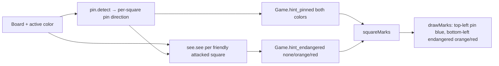
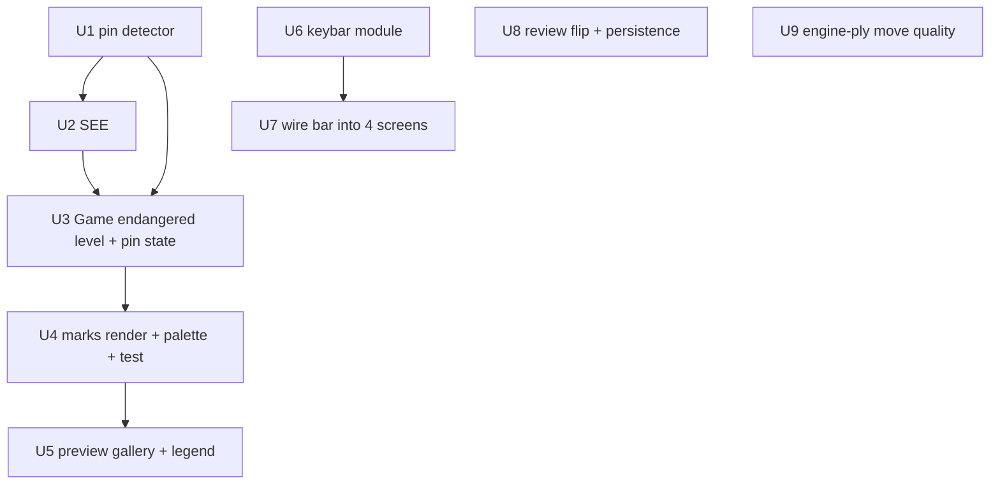

# feat: Controls bar, threat marks & review improvements

## Summary

Deliver three independent TUI upgrades behind one shared chess foundation. (1) Replace the four ad-hoc plain-text key footers with a single persistent, zellij-style keybind bar pinned to the bottom row of every screen, each key a tagged color chip. (2) Escalate the endangered-piece aid from a boolean "attacked" flag to a static-exchange-evaluation (SEE) verdict — orange when attacked but not losing material, red when the opponent strictly wins material — and add a blue absolute-pin mark for pieces of both colors. (3) Let the review screen flip to the player's perspective (`F`) and show move quality for engine plies, not just the player's. The threat-mark work introduces a pure SEE evaluator and an absolute-pin detector under `src/chess/`; the bar and review work do not depend on them and can ship independently.

---

## Problem Frame

Rozinante is a chess *learning* game whose control hints, danger signal, and review screen are each muddier than a beginner needs (full pain narrative in origin). The controls live in four independent footers that move with panel content and disappear behind modal prompts; the endangered aid cannot tell "attacked but safe" from "about to lose material" and has no concept of pins; the review board never flips for a Black player and rates only the player's own moves. See origin: `docs/brainstorms/controls-threat-marks-review-requirements.md`.

---

## Requirements

- R1. Persistent full-width keybind bar pinned to the bottom of every screen (menu, game, review, history); below board and panel on game/review.
- R2. Each key is a discrete color chip (tagged glyph + short label), visually separated zellij-style.
- R2a. Chip background colors are theme-invariant and meet a minimum contrast against every theme background; a palette-style test covers chip-vs-background contrast.
- R3. Bar contents are context-sensitive (exactly the keys valid in the current state); in engine-thinking only resign/flip/quit/menu chips show (cursor/select/undo/hint suppressed as inert).
- R4. Confirm prompts present `Y Yes` / `N No` chips in the bar; Enter→Yes / Esc→No stay active but unshown; the question text stays in the panel.
- R5. Transient game *status* (turn, "Check!", "Engine thinking…", promotion picker) stays in the panel; the bar is keys only.
- R6. Reserved bar height reduces board/panel area; every screen's too-small threshold accounts for the reserved row(s) (shared `renderResizeMessage` callers, menu inline check, new history check).
- R6a. On overflow, the bar drops a fixed lowest-priority tail (cursor/move > Enter/select > Esc/back > Q quit > N menu > rest); dropped keys stay active; minimum width bumped so the widest required state keeps the priority head.
- R7. Endangered aid marks a friendly **non-king** piece at two severities: orange when attacked but SEE ≤ 0, red when SEE > 0; even trade (SEE = 0) is orange. King excluded (check is its signal).
- R8a. Orange/red verdict decided by SEE (cheapest-attacker-first, piece values), not raw attacker-vs-defender count.
- R8b. SEE is x-ray-aware: a sliding attacker/defender behind a captured front piece is revealed by re-scanning after each capture.
- R8c. SEE is pin-aware: a defender pinned to its own king may recapture only along the pin ray; the king may not recapture into check. The shared pin detector returns the **pin direction** per pinned piece, not a boolean.
- R9. Endangered marks stay friendly-only, keep the bottom-left corner; only color escalates. The boolean field becomes a three-state level (none / orange / red).
- R10. Pin hint marks any absolutely-pinned piece with a blue mark in the top-left corner.
- R11. Pin hint marks pinned pieces of *both* colors with the same blue mark (only aid that marks both sides).
- R12. Endangered and pin are togglable learning aids shown only when hints are enabled, recomputed on the same refresh as existing aids.
- R13. The two new mark colors (blue pin, escalation red) are theme-invariant and pairwise-distinct by a stated perceptual delta from every other mark color; the perceptual delta applies only to pairs involving a new color (existing-vs-existing keep bare inequality, no shipped color retuned); the palette-distinctness test gains the two new colors and flash.
- R14. The preview gallery and legend gain the pin mark and the two-level endangered colors, including a pinned+endangered-red square.
- R15. Review screen flips orientation on `F` (matching the game flip key); orientation persists while stepping.
- R15a. On entry, review defaults to the player's perspective (`flipped = player_color == .black`); `F` toggles from that; orientation persists across leaving/re-entering review within a session, not across program restarts.
- R16. Move-quality line shown for engine plies as well as player plies, derived from each ply's already-computed centipawn loss via the same tier thresholds.

**Origin actors:** A1 (Player — reads bar, threat marks, review), A2 (Developer — judges marks via `zig build preview`).
**Origin acceptance examples:** AE1 (R7, R8a — hung queen → red), AE2 (R7, R8a — outnumbered pawn → orange), AE3 (R8c — pinned defender not counted → red), AE4 (R10, R11 — pin both colors blue), AE5 (R3, R4 — resign confirm chips), AE6 (R15 — flip persists while stepping), AE7 (R16 — engine ply quality shown), AE8 (R7 — even trade → orange), AE9 (R8c — pinned rook recaptures along ray), AE10 (R1, R5 — bar same place, no duplicate chips), AE11 (R6 — no overlap at min size), AE12 (R14 — gallery pinned+endangered + legend), AE13 (R8b — x-ray reveals queen → red).

---

## Scope Boundaries

- No new keybindings except the review-screen flip (R15); the bar re-presents existing keys.
- SEE is used only for the endangered verdict; it does **not** change move generation — `legalMoves` stays brute-force (make-move + king-in-check), per the project's clarity-over-optimization ethos.
- Pin hint covers absolute pins only (pinned to own king). Relative pins, skewers, forks, discovered attacks are not detected.
- Skewer / discovered-attack detection and post-game tactical annotations are out of scope. The pin detector is built strictly for its two in-scope consumers.
- Theme palette otherwise unchanged except the two new **mark** colors plus the keybar chip chrome colors (R2a); existing colors are not retuned.
- Promotion picker stays an in-panel widget; not moved into the bar.
- Engine move-quality reuses the existing good/meh/bad tiers and glyphs; no new rating vocabulary.
- Endangered severity (orange vs red) is distinguished by **color only** — by deliberate decision, this plan adds no shape/position cue. This is a known colorblind-accessibility tradeoff (orange↔red is the worst pair under red-green deficiency), accepted for v1; it diverges from the `tierGlyph` shape-cue precedent used for move quality. A non-color cue is a follow-up (below).

### Deferred to Follow-Up Work

- **Dynamic (mid-exchange) SEE pin recomputation** — catching pins that form/dissolve as pieces vacate during the capture sequence. Ship static (this plan); upgrade only if a flagged position proves visibly wrong. (see origin: Deferred to Planning, Affects R8c)
- **Per-category / per-key chip coloring** — this plan ships one uniform theme-invariant chip background; a richer category palette (navigation/action/danger/toggle) is later polish iterated against the preview workflow. (see origin: Affects R2)
- **Bar as a top-level child window owned by a shared layout** — this plan draws the bar per-screen via a shared module; consolidating ownership is a later refactor if a fourth+ screen makes per-screen reservation repetitive.
- **Colorblind cue for endangered severity** — add a non-color differentiator (e.g. red = doubled bottom-left + bottom-right block, or a distinct corner glyph) so orange-vs-red reads without hue, matching the `tierGlyph` shape-cue precedent. Deliberately deferred this turn; v1 ships color-only.

---

## Context & Research

### Relevant Code and Patterns

- `src/tui/renderer.zig` — `Palette` (mark colors, theme-invariant via `paletteOf`), `Marks` struct + `squareMarks` (pure game→marks mapping), `drawMarks` (layered corner/edge composition: best-move top-right, endangered bottom-left, cursor edge-midpoints — **top-left is free**), `tierGlyph`/`tierColor`, `renderInfoPanel` (in-game + game-over footers to remove), `renderResizeMessage`, palette-distinctness test (`palette: marks pairwise-distinct …`, ~line 958, uses bare `!std.meta.eql`, omits flash). Min cell 12×6; `boardWidth`/`boardHeight` derive geometry.
- `src/tui/game.zig` — `Game` struct (`hint_endangered: [64]bool`, `hint_best_move`, `flipped`, `engine_state`, `player_color`, pending flags), `computeEndangered` (boolean `isSquareAttacked` loop), `clearHints`, `flipBoard`. `EngineState` enum (idle/thinking/error/reconnecting).
- `src/main.zig` — `renderGame` composes `board_win` + `info_win` children off `vx.window()`; resize gate `MIN_W=118 / MIN_H=49` (= `boardWidth(.{})+1+19` / `boardHeight(.{})`) via `fits`; `runGameViewer` rebuilds `ViewerState` per entry (two call sites: history list, game-over); three hint-recompute sites call `computeEndangered` (~lines 1057, 1076, 1141); menu loop and history loop each render off `vx.window()`.
- `src/tui/viewer.zig` — `ViewerState` (has `player_color`, `analysis`), `render` calls `renderBoardCore(..., false, null)` (flip hardcoded), `handleInput` (no `F`), `renderAnalysisLines` Move line gated on `ma.tier` non-null, `drawTierGlyph` skips null tier, footer line, `moveLabel(cpl)` (already cpl-driven).
- `src/analysis.zig` — `Tier` enum, `meh_threshold=50` / `bad_threshold=100`, `MoveAnalysis.cpl` (computed every ply) + `.tier` (null on engine plies), `rateMove` (inline threshold logic to extract into `tierFromCpl`).
- `src/chess/movegen.zig` — `isSquareAttacked` (only attack primitive; sliding scans already in the shape SEE needs), `makeMove`, `legalMoves`. No piece values, no pin detection.
- `src/chess.zig` — barrel; new `see`/`pin` modules wire here.
- `src/piece_preview.zig` — the `zig build preview` mark gallery + legend (R14 target).
- `src/tui/menu.zig` — inline size check (`win.width < 20 or win.height < 14`), footer hint line. `src/tui/history.zig` — footer hint, **no resize check today** (R6).

### Institutional Learnings

- No `docs/solutions/` directory exists in this repo; no institutional learnings to carry. `docs/architecture.md` (decision log) and `docs/zig-0.16-notes.md` are the standing references.
- `docs/zig-0.16-notes.md` — consult before `std.mem` trims, `std.Io`/`Writer`, `@embedFile`, or anonymous-struct returns (relevant to SEE scratch buffers and module returns).

### External References

- None. All patterns are local (the highlight-redesign already shipped the layered mark language; SEE/pin are textbook chess algorithms with no library dependency). No high-risk domain (offline local UI).

---

## Key Technical Decisions

- **Two new pure chess modules, barrel-wired.** `src/chess/pin.zig` (absolute-pin detector) and `src/chess/see.zig` (SEE, depends on pin) follow the `src/chess/` convention: pure, allocator-free, stack arrays, in-file tests, re-exported via `src/chess.zig`. Matches `analysis.zig`'s pure-core posture.
- **Pin detector returns direction, not a boolean.** A `[64]?Direction`-shaped result (or per-square optional ray axis): the pin hint reads only presence; SEE needs the ray to permit a pinned piece's legal along-the-ray recapture (R8c). One primitive, two consumers.
- **SEE returns net material for the initiating side.** `see(board, target, by_color) i32` = material `by_color` nets by initiating the capture sequence on `target`, with optimal stand-pat, cheapest-attacker ordering, x-ray re-scan after each capture, and pinned-defender filtering. Endangered red iff `see(board, sq, opponent) > 0`; orange iff attacked and `<= 0`.
- **Standard piece values; king cannot recapture into check.** P1 N3 B3 R5 Q9, king effectively infinite. A king is admitted as a recapturer only when no enemy attacker still defends the square (mirrors R8c "may not recapture into check"); king is never a *victim* of the aid (R7).
- **Endangered becomes a tri-state level on `Game`.** `hint_endangered: [64]EndangeredLevel` (`none/orange/red`, enum defined in `game.zig` so both producer and `renderer` consumer see it without an import cycle) plus `hint_pinned: [64]bool`. `Marks.endangered` becomes the level; `Marks.pin` is new.
- **Per-screen bar via a shared `keybar` module, one reserved row.** New `src/tui/keybar.zig` owns chip data + priority-drop layout + chip palette; each screen reserves the bottom row off `vx.window()` and passes the matching chip set. Resolves the origin's bar-ownership/height question to the simplest form that fits the existing per-screen render structure.
- **Review orientation persists via a process-lifetime flag in `main.zig`.** `runGameViewer` rebuilds `ViewerState` each entry, so a file-scope `var review_flipped: ?bool` seeds `viewer.flipped` (`review_flipped orelse (player_color == .black)`). It is written back **only when the player explicitly toggles with `F`** — never on the auto-default — so a game whose orientation was never toggled always opens to its own player perspective (R15a). Session persistence, not restart persistence.
- **`analysis.tierFromCpl` extracted and shared.** The threshold logic in `rateMove` becomes `pub fn tierFromCpl(cpl) Tier`; the viewer derives engine-ply tiers from the always-present `cpl` (R16) and `rateMove` reuses it.

---

## Open Questions

### Resolved During Planning

- **SEE pin fidelity (static vs dynamic)** → Static absolute-pin baseline only; dynamic deferred to follow-up (origin's recommendation).
- **Piece values & king-exchange termination** → P1 N3 B3 R5 Q9, king infinite; king admitted as recapturer only when the square is no longer defended.
- **Bar ownership & reserved height** → Per-screen render via shared `keybar` module, 1 reserved row.
- **Chip rendering style** → One uniform theme-invariant chip background (key glyph in contrasting fg, label dim); per-category coloring deferred.
- **Where the `EndangeredLevel` enum lives** → `game.zig` (producer), consumed as `game_mod.EndangeredLevel` by `renderer.zig` (no import cycle).
- **Mixed-color review re-entry** → Persist the review orientation only when the player explicitly toggles with `F`; an untoggled game always opens to its own player-perspective default (so a Black-game review never flips the next White-game review).

### Deferred to Implementation

- Exact perceptual-delta metric and threshold for R13 (Euclidean RGB vs weighted luminance) — pick the simplest that separates the new red from check/flash red and clears the new-color pairs; tune against the four presets.
- Exact chip glyphs/spacing for multi-key chips (`↑↓←→`, `Home/End`, `n/p`) and the separator style — iterate against `zig build preview`/live render.
- Whether the move-list per-ply tier glyphs (`drawTierGlyph`) also derive from `cpl` for engine plies, or only the single "Move" line does — decide for visual consistency when wiring U9 (the "Move" line is the R16/AE7 requirement; the list glyphs are a consistency follow-through).

---

## High-Level Technical Design

> *This illustrates the intended approach and is directional guidance for review, not implementation specification. The implementing agent should treat it as context, not code to reproduce.*

**Per-screen bottom-bar reservation** (every screen, identical shape):

```
+--------------------------------------------------+  win = vx.window()
|  board_win / panel_win / menu / list (body)      |  height = win.height - keybar.height
|                                                  |
+--------------------------------------------------+
|  keybar (full width, 1 row, pinned to bottom)    |  y_off = win.height - keybar.height
+--------------------------------------------------+
```
Resize gate per screen bumps by `keybar.height` (game: `MIN_H = boardHeight + keybar.height`; menu/viewer/history likewise). Board/panel stay top-aligned; the bar sits at the absolute bottom.

**Threat-mark data flow** (hints enabled, on every recompute):



**Unit dependency graph:**


Three independent tracks: U1→U5 (threat marks), U6→U7 (bar), U8/U9 (review). Only the threat-mark track is internally sequenced.

---

## Implementation Units

### U1. Absolute-pin detector

**Goal:** A pure detector that, for a position, reports which pieces are absolutely pinned (to their own king by an enemy slider) and along which ray — usable for both colors.

**Requirements:** R8c, R10, R11.

**Dependencies:** None.

**Files:**
- Create: `src/chess/pin.zig` (tests in-file)
- Modify: `src/chess.zig` (barrel re-export)

**Approach:**
- For each color: from that color's king, scan the 8 slider rays. On each ray, find the first friendly piece; if a second piece along the same ray is an enemy slider of the matching kind (bishop/queen on diagonals, rook/queen on orthogonals) with only empty squares between, the first friendly piece is absolutely pinned along that ray axis.
- Return a per-square result carrying the pin **axis/direction** (e.g. an enum of the 4 ray axes, or the `[2]i4` step) so SEE can test "is a recapture move along this ray". A boolean view (`isPinned`) is a trivial derived helper for the hint.
- Mirror `movegen.zig`'s ray-walk style (`offsetSquare`, `diagonal_dirs`/`straight_dirs`); reuse `chess.findKing`.

**Patterns to follow:** `src/chess/movegen.zig` sliding scans in `isSquareAttacked`; `src/analysis.zig` pure/allocator-free module shape; `src/chess.zig` barrel exports.

**Test scenarios:**
- Happy path: bishop pins knight to king on a diagonal → knight reported pinned with the diagonal axis. (Covers AE4.)
- Happy path: rook pins rook on an open file → inner rook pinned with the file axis. (Covers AE9 geometry.)
- Edge case: two friendly pieces between king and enemy slider → neither pinned (not absolute).
- Edge case: enemy slider of the wrong kind for the ray (rook on a diagonal) → not pinned.
- Edge case: friendly blocker beyond the first → only the first friendly piece on the ray is the pin candidate.
- Both colors: a White pin and a Black pin in the same position are both reported. (Covers AE4 symmetry.)
- Edge case: no king of a color present → no pins for that color, no crash.

**Verification:** `zig build test` passes the new in-file tests; the detector returns direction (not just bool) and handles both colors.

---

### U2. SEE evaluator (x-ray + pin-aware)

**Goal:** A pure static-exchange evaluator returning the net material the initiating side wins on a target square, accounting for x-ray reveals and pinned-defender restrictions.

**Requirements:** R8a, R8b, R8c.

**Dependencies:** U1.

**Files:**
- Create: `src/chess/see.zig` (piece-value table + `see`; tests in-file)
- Modify: `src/chess.zig` (barrel re-export)

**Approach:**
- Piece values P1 N3 B3 R5 Q9, king effectively infinite (a constant larger than any sum).
- Standard SEE swap algorithm: initialize the gain with the victim on `target`; alternate sides taking the cheapest available attacker of the square; after each capture, re-scan the square's attackers/defenders so a slider behind the just-moved piece is revealed (x-ray, R8b); apply stand-pat (a side stops when continuing would worsen its score).
- Pin filtering (R8c): a piece pinned (per U1) is admissible as a recapturer only if the capture square lies on its pin ray; the king is admissible only when the square has no remaining enemy defender (no recapture into check).
- API: `pub fn see(b: *const Board, target: Square, by_color: Color) i32`.

**Execution note:** Build the swap loop test-first against the origin acceptance examples — they are the precise oracle (each AE names the expected color, i.e. the SEE sign).

**Technical design:** *(directional)*

```
see(target, by_color):
  gain[0] = value(piece on target)              # victim
  attacker = cheapest admissible by_color attacker of target
  d = 1
  loop while attacker exists:
     gain[d] = value(captured-so-far) - gain[d-1]   # speculative swap-off
     remove attacker from board snapshot; reveal x-ray attackers
     side flips; attacker = cheapest admissible attacker for the new side
     d += 1
  fold back with stand-pat (max/min) → net for by_color
```

**Patterns to follow:** `src/chess/movegen.zig` attacker scans; `src/analysis.zig` stack-array purity; piece-type switch style in `game.zig`.

**Test scenarios:**
- Happy path: queen defended by a rook, attacked by a pawn → `see(opponent) > 0` (≈ +8). (Covers AE1.)
- Happy path: pawn defended by a pawn, attacked by two doubled rooks → `see <= 0` (loses a rook for a pawn). (Covers AE2.)
- Happy path: knight defended by a pawn, attacked by a knight (even trade) → `see == 0`. (Covers AE8.)
- Edge case (x-ray): bishop defended once, attacked by a bishop with a queen behind on the same diagonal → `see > 0` after the front bishop vacates. (Covers AE13.)
- Edge case (pin): the only defender is pinned off the capture ray → not counted, target `see > 0`. (Covers AE3.)
- Edge case (pin along ray): a pinned rook defending along its own pin ray *is* counted as a recapturer. (Covers AE9.)
- Edge case: undefended attacked piece → `see == value(piece)` (> 0).
- Edge case: defended piece, attacker more valuable than victim and no profitable continuation → `see <= 0`.
- Edge case: king as recapturer rejected when the square stays defended.

**Verification:** every origin AE for threat marks maps to a passing in-file SEE test with the expected sign; `zig build test` green.

---

### U3. Endangered level + pin state on `Game`

**Goal:** Replace the boolean endangered flag with the SEE tri-state level, add per-square pin state for both colors, and recompute both on the existing hint refresh.

**Requirements:** R7, R9, R10, R11, R12.

**Dependencies:** U1, U2.

**Files:**
- Modify: `src/tui/game.zig` (`EndangeredLevel` enum, `hint_endangered` type, new `hint_pinned`, `computeEndangered` rewrite, `computePins`, `clearHints`; update in-file tests)
- Modify: `src/main.zig` (three recompute sites also compute pins)

**Approach:**
- Add `pub const EndangeredLevel = enum { none, orange, red };`. Change `hint_endangered: [64]bool` → `[64]EndangeredLevel`; add `hint_pinned: [64]bool`.
- `computeEndangered`: for each friendly **non-king** piece (side to move), if attacked, set `red` when `see(board, sq, opponent) > 0` else `orange`; king skipped entirely.
- `computePins` (or fold into one `recomputeHints`): set `hint_pinned[sq] = true` for every absolutely-pinned piece of **either** color (U1).
- `clearHints` resets the level array to `.none` and `hint_pinned` to all-false plus existing `hint_best_move = null`.
- Update the three `computeEndangered` call sites in `main.zig` to also recompute pins (single helper preferred so they can't drift).

**Patterns to follow:** existing `computeEndangered`/`clearHints` in `game.zig`; the three recompute sites in `main.zig`.

**Test scenarios:**
- Happy path: friendly piece losing material → `hint_endangered[sq] == .red`. (Covers AE1.)
- Happy path: friendly piece attacked but safe/even → `.orange`. (Covers AE2, AE8.)
- Edge case: friendly king attacked (in check) → endangered stays `.none` for the king square (R7 exclusion).
- Edge case: unattacked friendly piece → `.none`.
- Happy path: pinned friendly piece and pinned enemy piece both set `hint_pinned`. (Covers AE4, R11.)
- Edge case: `clearHints` zeroes the level array, pin array, and best move.
- Edge case: initial position, hints on → no endangered, no pins (existing test updated to the new type).

**Verification:** updated `game.zig` tests pass; `main.zig` recompute sites set both arrays; `zig build test` green.

---

### U4. Mark rendering, palette colors & distinctness test

**Goal:** Render the blue pin (top-left) and the two-level endangered color (orange/red, bottom-left); add the new theme-invariant colors and extend the palette-distinctness test under R13's scoped rule.

**Requirements:** R9, R10, R11, R13.

**Dependencies:** U3.

**Files:**
- Modify: `src/tui/renderer.zig` (`Palette` adds `highlight_pin` + `highlight_endangered_high`; `Marks.endangered` → `EndangeredLevel`, `Marks.pin` added; `squareMarks` reads new `Game` state; `drawMarks` Layer-3 corners; palette-distinctness test; update in-file mark tests)
- Modify: `src/piece_preview.zig` (migrate the three existing `.endangered = true` literals to the `EndangeredLevel` form so the default build and preview keep compiling with the type change)

**Approach:**
- `paletteOf` sets `highlight_pin` (blue, distinct from `highlight_legal` cyan) and `highlight_endangered_high` (red, distinct from `highlight_check`/`highlight_flash`) — theme-invariant like the other marks.
- `Marks`: `endangered: game_mod.EndangeredLevel = .none`, `pin: bool = false`. `squareMarks` maps `game.hint_endangered[sq]`/`game.hint_pinned[sq]` (hints-gated, like existing aids).
- `drawMarks` Layer 3: pin → `hRun(left, left+1, top, FULL, Theme.highlight_pin, base)` (top-left, mirroring endangered's bottom-left and best-move's top-right); endangered → existing bottom-left run, color chosen by level (`highlight_endangered` orange vs `highlight_endangered_high` red).
- Palette-distinctness test: extend the compared set with both new colors and `highlight_flash`; apply the **perceptual delta only to pairs involving a new color**; existing-vs-existing pairs keep the current bare `!std.meta.eql` (R13 — no shipped color retuned).

**Patterns to follow:** `paletteOf`/`palette` color construction; `drawMarks` Layer-3 `hRun` corners; the existing `palette: marks pairwise-distinct …` test.

**Test scenarios:**
- Happy path: `squareMarks` yields `.pin = true` for a pinned square and `.endangered = .red`/`.orange` per level when hints on.
- Edge case: hints disabled suppresses pin and endangered (extend the existing suppression test).
- Happy path: a square simultaneously pinned and endangered-red composes both corners (top-left + bottom-left) without clobbering. (Covers AE12 composition.)
- Edge case: `drawMarks` containment still holds with the new corners (extend the containment test).
- Happy path (R13): for every theme, each new color clears the perceptual delta against every other mark color and flash; existing pairs still pass bare inequality.
- Edge case: classic palette RGBs for pre-existing colors unchanged (the existing classic-palette-RGB stability test still passes).

**Verification:** `zig build test` **and `zig build` / `zig build preview`** all green (the preview exe is outside the test graph); new colors distinct on all four presets; no existing color value changed.

---

### U5. Preview gallery & legend for the new marks

**Goal:** Show the pin mark and the two-level endangered colors (and a pinned+endangered-red square) plus legend entries in `zig build preview`.

**Requirements:** R14.

**Dependencies:** U4.

**Files:**
- Modify: `src/piece_preview.zig` (gallery states + legend)

**Approach:**
- Add gallery cells for: pinned (blue top-left), endangered-orange, endangered-red, and the combined pinned+endangered-red square; add a legend entry per new color. (The three pre-existing `.endangered` literals were migrated to the enum in U4; U5 adds the *new* cells on top.) Fit within the existing `~104×64` preview budget (reuse the current grid/legend layout; add rows/columns as the layout allows).

**Patterns to follow:** existing gallery cell + legend construction in `src/piece_preview.zig`; `drawMarks` is the shared renderer so gallery output matches live.

**Test scenarios:**
- Test expectation: none — `zig build preview` is a manual visual harness (A2 judges by eye). Verify by building and viewing; assert only that `zig build preview` compiles and runs.

**Verification:** `zig build preview` renders the pin mark, both endangered levels, the combined square, and a legend entry for each new color. (Covers AE12.)

---

### U6. Keybar module

**Goal:** A shared module owning chip data, per-state chip sets, priority-tail overflow drop, and theme-invariant chip palette + contrast test.

**Requirements:** R2, R2a, R3, R4, R6a.

**Dependencies:** None.

**Files:**
- Create: `src/tui/keybar.zig` (tests in-file)
- Modify: `src/tui/renderer.zig` (`Palette` adds `keybar_chip_bg` + `keybar_chip_fg`)
- Modify: `src/tui.zig` (barrel re-export)

**Approach:**
- `pub const Chip = struct { key: []const u8, label: []const u8 };` and `pub const height: u16 = 1;`.
- Per-state chip sets in **priority order** (highest first per R6a: cursor/move > Enter/select > Esc/back > Q quit > N menu > rest): normal play, engine-busy (resign/flip/quit/menu only — R3), promotion, confirm prompt (`Y Yes`/`N No` — R4), game-over, menu, history browse (full set), history empty (Esc/back only), history delete-confirm, review (full set), review-no-analysis (drop `n/p`).
- **`gameChips(game)` precedence must mirror `src/tui/input.zig` `handleKeyPress`**: modal-confirm (resign/quit/leave `Y/N`) > quit/menu > engine-busy > promotion > normal. A resign confirm opened *during* engine-thinking is reachable and re-rendered every loop, so checking `engine_state` first would show inert R/F/Q chips and hide the active Y/N.
- **Engine-busy = `engine_state == .thinking OR .reconnecting`** (the `input.zig` gate covers both); `.error` is NOT gated, so it keeps the normal set.
- History/review chip sets are context-sensitive: empty history (`games.len == 0`) shows only Esc/back; review drops `n/p` when `analysis_state != .ready` or `key_moment_count == 0` (those inputs are inert).
- Selector helpers fill these per screen; simple constants where the state doesn't vary.
- `pub fn render(win, chips: []const Chip)`: lay chips left-to-right with a separator; each chip = key glyph on `keybar_chip_bg`/`keybar_chip_fg`, label in `text_dim`. Stop before a chip that would overflow the bar width (priority-tail drop, R6a); dropped keys stay functionally active (the bar is display-only).
- `Palette`: `keybar_chip_bg`/`keybar_chip_fg` theme-invariant; add a contrast test analogous to the palette-distinctness test (chip bg vs each theme bg meets a min delta) — R2a.

**Patterns to follow:** `renderer.writeStr` cell writing; `paletteOf` color construction; the palette-distinctness test for the contrast test; the menu/info-panel footer strings being replaced (for the key/label wording).

**Test scenarios:**
- Happy path: `gameChips` for normal human turn returns the full set in priority order.
- Happy path (R3): `gameChips` during engine-thinking returns exactly resign/flip/quit/menu (no cursor/select/undo/hint). (Covers AE5 sibling.)
- Happy path (R4): confirm-prompt state returns `Y Yes` / `N No`. (Covers AE5.)
- Edge case (R6a): when total chip width exceeds the bar, the priority head is kept and the tail dropped; head order is stable.
- Edge case: a width too small for even one chip renders nothing without crashing.
- Happy path (R2a): for every theme, `keybar_chip_bg` clears the contrast threshold against the theme background.
- Happy path (R3): the reduced set also applies during `.reconnecting`; `.error` keeps the normal set.
- Edge case (precedence): a resign confirm opened while engine-thinking returns `Y Yes`/`N No`, not the engine-busy chips.
- Edge case: empty history returns Esc/back only; review with no analysis (or zero key moments) omits `n/p`.

**Verification:** `zig build test` green; chip sets and priority-drop behave per R3/R4/R6a; chip palette passes the contrast test.

---

### U7. Wire the bar into all four screens; reserve row; bump gates; remove old footers

**Goal:** Render the persistent bar on menu, game, review, and history; reserve the bottom row everywhere; bump every too-small threshold; delete the four legacy footers and the in-panel keybind hints.

**Requirements:** R1, R3, R4, R5, R6, R6a.

**Dependencies:** U6.

**Files:**
- Modify: `src/main.zig` (`renderGame` reserves the bar row + renders it; `MIN_H` bump by `keybar.height`; menu loop and history loop render the bar; viewer call path unaffected — viewer renders its own bar in U8/here)
- Modify: `src/tui/renderer.zig` (`renderInfoPanel`: remove the two in-game hint lines + the game-over `R Review N Menu Q Quit` footer; status text stays, but **reduce the confirm strings to the question only** (`Resign?` / `Quit game?` / `Leave to menu?`) and **strip the inline key tokens from the promotion line** — the bar now carries `Y/N` and `←→/Enter/Esc`, so leaving them inline duplicates chips and violates AE10 — R4/R5/AE10)
- Modify: `src/tui/menu.zig` (remove footer hint; bump inline size check by the bar row; render bar)
- Modify: `src/tui/history.zig` (remove footer hint; **add** a too-small check accounting for the bar; render bar; delete-confirm shows `Y Yes`/`N No` via the bar)
- Modify: `src/tui/viewer.zig` (render the bar from its render path; remove its footer; **bump the viewer's own resize guard `if (win.width < board_w or win.height < board_h)` to `board_h + keybar.height`** so the review board never overlaps the bar at min height — AE11; strip the `n/p` key prefix from the retained key-moment panel line so it doesn't duplicate the bar chip — coordinated with U8)

**Approach:**
- Each screen: `body = win.child(height = win.height - keybar.height)`; render existing content into `body`; `bar_win = win.child(y_off = win.height - keybar.height, width = win.width, height = keybar.height)`; `keybar.render(bar_win, chips)`.
- `renderGame`: keep board/panel top-aligned; gate `fits` on `MIN_H = boardHeight(.{}) + keybar.height`, and **bump `MIN_W` so the widest required chip head (normal play, hints on) fits without dropping a priority-head chip — R6a** (the threshold lives in each `renderResizeMessage` *caller*, not the helper). Panel no longer reserves its bottom rows for hints (frees space for move history).
- History gets its first resize guard: if `win.height <= keybar.height` (or below a small content minimum), show the resize message instead of overlapping.
- Confirm prompts (resign/quit/leave in game; delete in history): question text stays in panel/list; the bar carries `Y Yes`/`N No` (R4).

**Patterns to follow:** `renderGame` child-window composition; `renderResizeMessage`; the existing per-screen render entry points; `MIN_W`/`MIN_H` geometry derivation.

**Test scenarios:**
- Integration: render the game screen to an offline screen at min size → the bar row paints and board/panel do not overlap it. (Covers AE10, AE11.)
- Integration: no screen body duplicates a key the bar shows (panel no longer prints keybind hints). (Covers AE10.)
- Happy path: game-over state shows `R Review` / `N Menu` / `Q Quit` chips in the bar, not in the panel.
- Edge case: history at a height that only fits the bar → resize message, no overlap. (Covers AE11.)
- Edge case: confirm prompt keeps the question in the panel and the `Y/N` chips in the bar. (Covers AE5.)
- Integration: the review screen at min height (`board_h + keybar.height`) renders the bar without overlapping the board (AE11, viewer's own guard).

**Verification:** `zig build test` green; `zig build run` shows the bar on every screen at the same bottom location; min-size renders never overlap; no legacy footer remains.

---

### U8. Review board flip + session-persistent orientation

**Goal:** Flip the review board on `F`, defaulting to the player's perspective, persisting the choice across re-entry within a session.

**Requirements:** R15, R15a.

**Dependencies:** None. (Coordinate the viewer bar wiring with U7.)

**Files:**
- Modify: `src/tui/viewer.zig` (`ViewerState.flipped` field; `handleInput` handles `F`; `render` uses `self.flipped` instead of hardcoded `false`; add `F Flip` to the viewer chip set)
- Modify: `src/main.zig` (`runGameViewer` seeds `viewer.flipped` from a file-scope `var review_flipped: ?bool`, written back **only when the player explicitly toggled with `F`**)

**Approach:**
- Add `flipped: bool = false` to `ViewerState`; `render` passes it to `renderBoardCore`.
- `handleInput`: `if (key.matches('f', .{})) self.flipped = !self.flipped;`.
- `runGameViewer`: `viewer.flipped = review_flipped orelse (viewer.player_color == .black)`; persist `review_flipped` **only when the player pressed `F`** (track a `user_toggled` flag on `ViewerState`), so a game whose orientation was never toggled always opens to its own player-perspective default — this fixes the mixed-color re-entry bug (reviewing a Black game must not flip the next White game). Process lifetime, not disk — R15a.

**Patterns to follow:** `game.flipBoard`; `renderBoardCore(..., flipped, …)` signature already takes a flip bool; viewer `handleInput` key matching.

**Test scenarios:**
- Happy path: `F` toggles `flipped`; stepping forward/backward preserves it. (Covers AE6.)
- Happy path (R15a): a Black player's review defaults to `flipped = true`; a White player's to `false`.
- Edge case: an explicit `F` toggle is reused on the next entry; a game whose orientation was never toggled opens to its own player default — reviewing a Black game then a White game shows each side player-side-up (mixed-color re-entry).

**Verification:** `zig build test` green (viewer flip tests); `zig build run` → review as Black opens player-side-up, `F` flips and persists across re-entry.

---

### U9. Engine-ply move quality in review

**Goal:** Show the "Move" quality line for engine plies as well as player plies, derived from the always-present centipawn loss.

**Requirements:** R16.

**Dependencies:** None.

**Files:**
- Modify: `src/analysis.zig` (extract `pub fn tierFromCpl(cpl: i32) Tier`; reuse it in `rateMove`)
- Modify: `src/tui/viewer.zig` (`renderAnalysisLines` "Move" line derives the tier from `cpl` when `ma.tier` is null; optionally `drawTierGlyph` likewise)

**Approach:**
- `tierFromCpl(cpl)`: the existing `>= bad_threshold` / `>= meh_threshold` / else logic, extracted; `rateMove` calls it (no behavior change for player plies).
- Viewer "Move" line: `const t = ma.tier orelse analysis.tierFromCpl(ma.cpl);` then render glyph + `moveLabel(ma.cpl)` (already cpl-driven). Decide during wiring whether the move-list glyphs derive too (see Deferred to Implementation).

**Patterns to follow:** `analysis.rateMove` threshold logic; `viewer.renderAnalysisLines` Move-line rendering; `tierGlyph`/`tierColor`/`moveLabel`.

**Test scenarios:**
- Happy path: `tierFromCpl` maps boundary values good/meh/bad (0, 49→good, 50→meh, 99→meh, 100→bad, 300→bad).
- Happy path: `rateMove` still returns the same tier after the extraction (existing tests pass unchanged).
- Integration: stepping to a position reached by an engine ply renders the "Move" quality line (previously blank). (Covers AE7.)
- Edge case: a player ply still uses its stored `tier` (unchanged display).

**Verification:** `zig build test` green; review shows a quality read on engine replies; player-ply display unchanged.

---

## System-Wide Impact

- **Interaction graph:** the bar reserves the bottom row on all four render paths (`renderGame`, menu, history, viewer) off `vx.window()`; the three hint-recompute sites in `main.zig` now drive two arrays (endangered level + pins). `analysis.tierFromCpl` becomes a shared primitive (viewer + `rateMove`).
- **Error propagation:** SEE and the pin detector are pure and total (no allocation, no I/O) — they cannot fail; a missing king yields no pins rather than a crash. The bar is display-only; dropped chips never disable a binding.
- **State lifecycle risks:** `Marks.endangered` changes type (bool→enum) — every `squareMarks`/`drawMarks` caller, the in-file mark tests, **and `src/piece_preview.zig`'s three `.endangered` literals** must move in lockstep (U4). Note `piece_preview.zig` is outside the `zig build test` graph (it builds only under `zig build`/`zig build preview`), so run those too or the default build breaks silently. Review orientation lives in a process-lifetime `var`, written only on an explicit `F` toggle and reset only at process start.
- **API surface parity:** the endangered aid is the only consumer of the boolean→tri-state change; no persistence/PGN format touches it. The pin detector and SEE are additive barrel exports.
- **Integration coverage:** offline-screen render tests (existing pattern in `renderer.zig`/`viewer.zig`) prove bar non-overlap and engine-ply quality painting — behaviors mocks alone won't show.
- **Unchanged invariants:** `legalMoves` stays brute-force; existing mark corners (best-move top-right, endangered bottom-left, cursor edge-midpoints) and their colors are unchanged except the added top-left pin and the endangered red tier; PGN/analysis on-disk format unchanged.

---

## Risk Analysis & Mitigation

| Risk | Likelihood | Impact | Mitigation |
|------|-----------|--------|------------|
| SEE swap/x-ray/pin logic subtly wrong (mis-colored marks) | Med | Med | Build test-first against all origin AEs (the sign oracle); AE1/2/3/8/9/13 cover the tricky cases. |
| `Marks.endangered` type change misses a caller | Low | Med | Compiler catches every reference, but `piece_preview.zig` is outside `zig build test` — run `zig build` + `zig build preview` too; its three `.endangered` literals migrate in U4. |
| Perceptual-delta threshold flags a shipped color or fails to separate the new red | Med | Low | R13 scopes the delta to new-color pairs only; tune the threshold against the four presets; existing pairs keep bare inequality. |
| Bar overflow drops a head chip at min width | Low | Med | R6a fixes the priority order and bumps min width so the widest required state keeps the head; unit test asserts head stability. |
| Review orientation persists wrongly across mixed-color sessions | Low | Med | Persist only the explicitly-chosen orientation (write on `F` toggle only); a game never toggled uses its own player default (U8). |
| Bar row reservation overlaps content on a screen whose gate wasn't bumped (esp. history, which had none) | Med | Med | U7 bumps every gate — `fits`/`MIN_H`, the menu check, the viewer's own `board_h` guard, and a new history check; offline-render overlap tests cover AE11 on the game and review screens. |

---

## Phased Delivery

Three independent tracks; the threat-mark track is the only internally-sequenced one. Per origin severability, the bar and review tracks are **not** gated on the SEE work and may land first.

### Phase A — Chess foundation
- U1 (pin detector), U2 (SEE). Pure, fully unit-tested against the AEs before any UI wiring.

### Phase B — Threat marks
- U3 (Game state), U4 (mark render + palette), U5 (gallery). Depends on Phase A.

### Phase C — Keybind bar (independent)
- U6 (module), U7 (wire + remove footers). Can ship before or in parallel with Phases A/B.

### Phase D — Review screen (independent)
- U8 (flip + persistence), U9 (engine-ply quality). Can ship before or in parallel with Phases A/B/C.

---

## Sources & References

- **Origin document:** [docs/brainstorms/controls-threat-marks-review-requirements.md](docs/brainstorms/controls-threat-marks-review-requirements.md)
- Related code: `src/tui/renderer.zig` (`drawMarks`, `squareMarks`, `Palette`, palette test), `src/tui/game.zig` (`computeEndangered`, `Game`), `src/chess/movegen.zig` (`isSquareAttacked`), `src/analysis.zig` (`Tier`, `cpl`, `rateMove`), `src/tui/viewer.zig` (`ViewerState`, `renderAnalysisLines`), `src/main.zig` (`renderGame`, `fits`, `runGameViewer`), `src/piece_preview.zig` (gallery)
- Standing references: `docs/architecture.md` (decision log, TUI/engine patterns), `docs/zig-0.16-notes.md` (API pitfalls)
